# 3D Printer

Con [stampa 3D](https://it.wikipedia.org/wiki/Stampa_3D) si intende la realizzazione di oggetti tridimensionali mediante produzione additiva, partendo da un modello 3D digitale.   
Le stampanti 3D sfruttano diverse tecnologie per la produzione, la più diffusa è la [tecnologia FDM (Fused Deposition Modeling)](https://it.wikipedia.org/wiki/Modellazione_a_deposizione_fusa). Questa tecnologia lavora su un principio "additivo" rilasciando il materiale su strati. Un filamento termoplastico è srotolato da una bobina, che fornisce il materiale ad un ugello di estrusione, con il quale è possibile gestire il flusso. L'ugello è riscaldato per poter sciogliere il materiale e può essere guidato sia in direzione orizzontale che verticale da un meccanismo a controllo numerico, seguendo un percorso tracciato.

<!-- inserire indice -->
## Indice degli agomenti:
- [Applicazioni](#applicazioni)
- [Strumenti, materiali e file](#strumenti-materiali-e-file)
- [Processo di stampa](#processo-di-stampa)
- [Post-processing](#post-processing)
- [FAQ](#faq)

## Applicazioni

La tecnologia di Stampa 3D permette di creare in modo efficiente pezzi unici e geometrie estremamente complesse, non realizzabili altrimenti. Per questo motivo le sue applicazioni sono molte e in continua crescita, dalla creazione di prototipi, protesi e ortesi mediche personalizzate, ma ache utilizzi nei settori industriali più disparati: settori aerospaziale, automobilistico, alimentare, edile, medico e biomedico.

In base al tipo di tecnologia di stampa 3D cambiano anche i materiali utilizzabili.   
Con la tecnologia FDM è possibile lavorare polimeri termoplastici ([PLA](https://www.3ditalyshop.it/prodotti/filamenti/1-75/pla_1-75/), [ABS](https://www.3ditalyshop.it/prodotti/filamenti/1-75/abs_1.75/), [Nylon](https://www.3djake.it/filamenti-per-stampanti-3d/filamenti-di-nylon), [PETG](https://www.3ditalyshop.it/prodotti/filamenti/1-75/pet_1.75/), [PVA](https://www.3ditalyshop.it/prodotti/filamenti/1-75/pva-1.75/)), termoplastici elastomerici ([TPU](https://www.3ditalyshop.it/prodotti/filamenti/1-75/tpu-98a-1-75/)), polimeri di tipo ingegneristico ([PEEK](https://www.3djake.it/filamenti-per-stampanti-3d/filamenti-peek-per-stampanti-3d-fdm), [PEI](https://www.3djake.it/filamenti-per-stampanti-3d/pei-ultem)), ma anche materiali compositi costituiti da una matrice polimerica e caricati con fibre o con carica metallica (questi richiedono un post processo di sinterizzazione in cui la matrice termoplastica evapora lasciando solo le parti metalliche).

## Strumenti, materiali e file
Prima di iniziare assicurati di avere tutto il necessario:
- Stampante 3D
- Bobina di filamento
- PC con installati i software necessari
- File da stampare
- Accessori (lacca, pinzette, spatola, tronchesina)

### 3D printer Creality CR-10 S

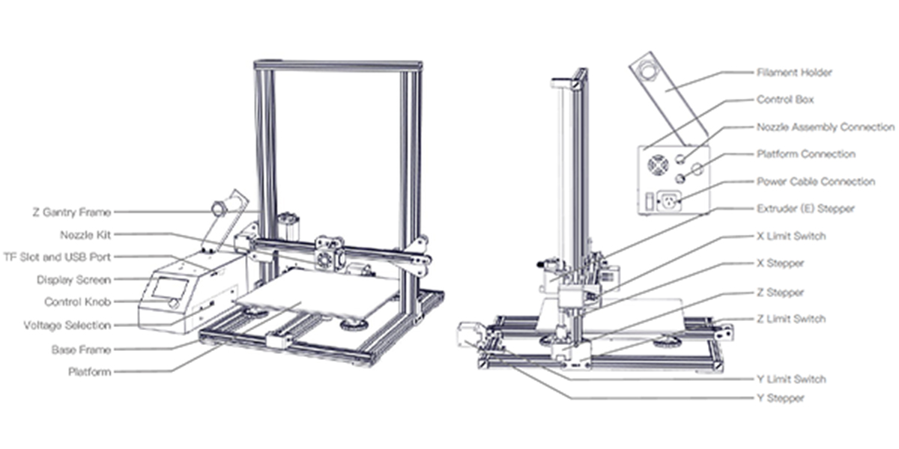    

| Caratteristiche tecniche           | Valori                                   |   
|:-----------------------------------|:-----------------------------------------|   
| Dimensione massima di stampa       | 300 x 300 x 400 mm                       |   
| Nozzle montato                     | 0,4 mm                                   |   
| Spessore dello strato              | 0,1 - 0,32 mm                            |   
| Precisione di stampa               | ±0,1 mm                                  |   
| Diametro del filamento             | 1,75 mm                                  |   
| Temperatura massima del piatto     | 100 ℃                                   |   
| Temperatura massima del nozzle     | 250 ℃                                   |   
| Velocità massima di stampa         | 180 mm/s                                 |   
   
   
### 3D printer Creality CR-10 S5

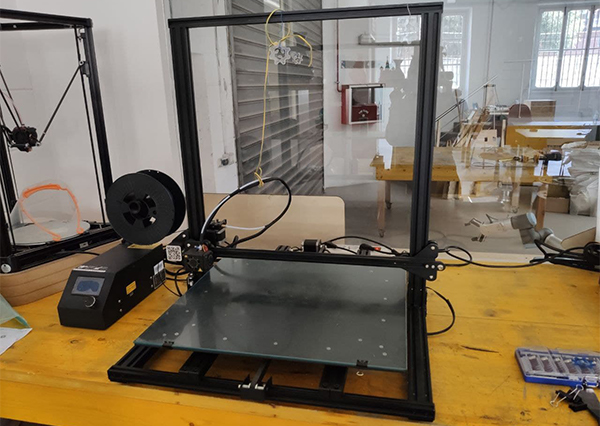   

| Caratteristiche tecniche           | Valori                                   |   
|:-----------------------------------|:-----------------------------------------|   
| Dimensione massima di stampa       | 500 x 500 x 500 mm                       |   
| Spessore dello strato              | 0,1 - 0,48mm                             |   
| Nozzle montato                     | 0,6 mm                                   |
| Precisione di stampa               | ±0,1 mm                                  |   
| Diametro del filamento             | 1,75 mm                                  |   
| Temperatura massima del piatto     | 60 ℃                                    |   
| Temperatura massima del nozzle     | 250 ℃                                   |   
| Velocità massima di stampa         | 180 mm/s                                 |     

Per ulteriori informazioni sulla linea Creality CR-10 consultare la [scheda tecnica](src/cr10-user-manual.PDF)

### Bobina di filamento
I materiali sono comunemente commercializzati sotto forma di bobine di filamenti o pellets.   
Le stampanti del Fablab utilizzano filamenti di [PLA di diametro 1.75 mm](https://www.3ditalyshop.it/prodotti/filamenti/1-75/pla_1-75/), disponibile in tantissimi colori e di facile lavorabilità.   

### PC con installati i software necessari
Per la fase di [slicing](https://it.wikipedia.org/wiki/Slicing) e di impostazioni di stampa è necessario avere sul proprio PC il software __Ultimaker Cura__.   
Per la fase di stampa e supervisione invece, al Fablab hai la possibilità di utilizzare __Control Box__ collegata alla stampante(lo trovi sulla sinistra di ogni macchina).

### File da stampare
La stampante 3D basa la stampa su un modello 3D diviso in layers attraverso il programma di slicing.   
Il software __Ultimaker Cura__ supporta modelli 3D nei formati 3MF, AMF, DAE, ZAE, CTM, STL, PLY, OBJ, X3D, GBL, GLTF e GCODE.   
Il PC collegato alla stampante legge file di stampa nel formato __STL__.

### Accessori
Durante la lavorazione si dovrà fare uso anche di oggetti esterni: la lacca si deve applicare sul __piatto in vetro__ della stampante prima dell'avvio della stampa, per assicurare una salda adesione del pezzo; le tronchesine servono a tranciare il filamento al momento del caricamento o rimozione del materiale; le pinzette sono per la rimozione delle sbavature di filamento durante la fase di riscaldamento del __nozzle__; la spatola è necessaria per il distaccamento dal __piatto__ del pezzo stampato alla fine del processo. 

## Processo di stampa

Per stampare in 3D segui i passaggi illustrati di seguito.

### Parametri di stampa

Avviare il software __Ultimaker Cura__ sul proprio PC e come primo passso si deve impostare la stampante che si ha intenzione di utilizzare Se è la prima volta che si avvia il programma la selezione di una stampante sarà nella configurazione iniziale, in caso contrario invece seguire il percorso _Pannello selezione stampante_>_Aggiungi stampante_>selezionare la stampante dalla lista>_Aggiungi_.
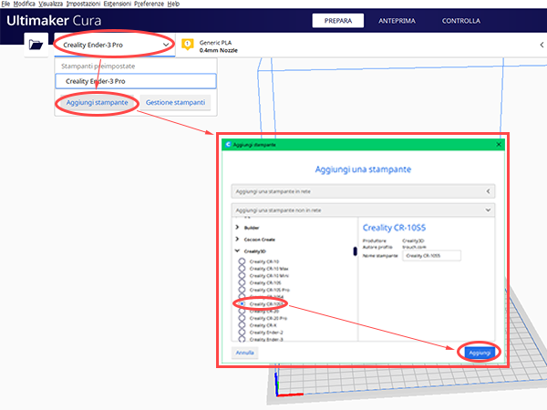   
Si aprirà quindi una ulteriore finestra, è sempre bene controllare che le informazioni riportate coincidano con le tabelle tecniche riportate nelle [sezioni dedicate alle due stampanti](#3d-printer-creality-cr-10-s). Premere quindi _Avanti_ per confermare.

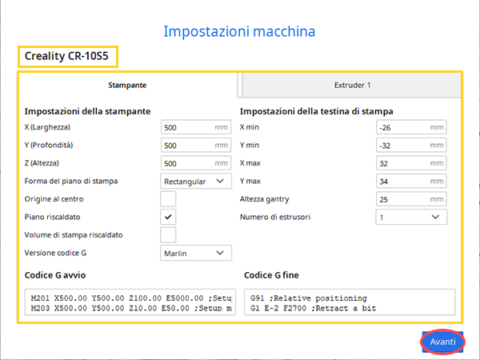

In base al diametro del __Nozzle__ (ugello) montato sulla stampante e al tipo di materiale che si intende utilizzare (al Fablab si utilizza esclusivamente [PLA o PLA+](#bobina-di-filamento)), bisogna cambiarne il parametro sul software. La dimensione del nozzle è riportata nelle [tabelle tecniche delle due stampanti](#3d-printer-creality-cr-10-s) e il valore si inserisce su __Ultimaker Cura__ come indicato in rosso nell'immagine sotto.
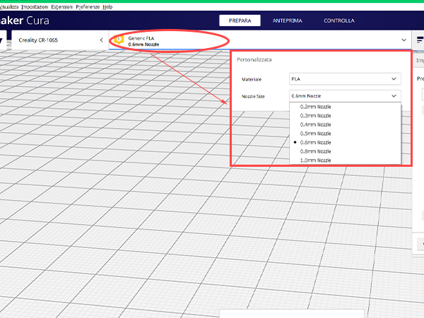

### Slicing del modello 3D

Il modello da stampare può essere creato tramite software di modellazione o scaricato da internet (alcune delle repository più conosciute: [Thingiverse](https://www.thingiverse.com/), [MyMiniFactory](https://www.myminifactory.com/),).   
Per aprire il modello su __Ultimaker Cura__ seguire il percorso _File_>_Apri file..._>selezionare il modello. 
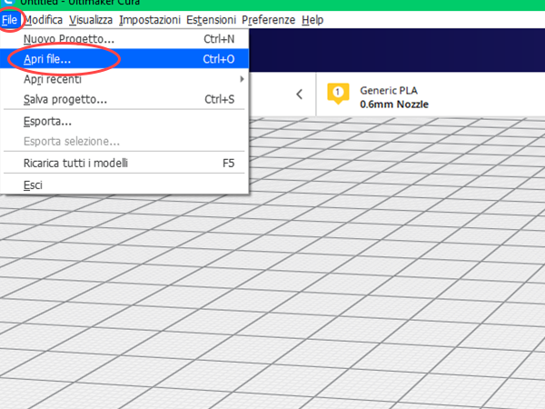
<!-- scrivere siti di modelli scaricabili -->

È possibile fare alcune modifiche base al modello direttamente dal software: tramite le icone poste sulla barra sinistra è possibile spostare, scalare e ruotare il modello secondo i tre assi.
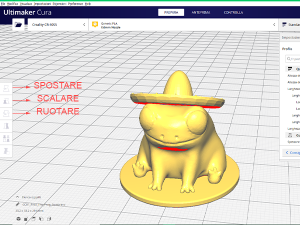

Importato il modello, una tendina sulla destra dello schermo mostrerà tutte le possibili regolazioni per la stampa (es. __temperatura del nozzle__, __temperatura del piatto__, __velocità di spostamento__), modificabili a piacimento.   
Il programma propone però anche dei __profili di stampa predefiniti__ che dovrebbero dare buoni risultati.
Impostate tutte le variabili, cambiare tab premendo su _ANTEPRIMA_ e avviare lo slicing con il tasto _Sezionamento_.
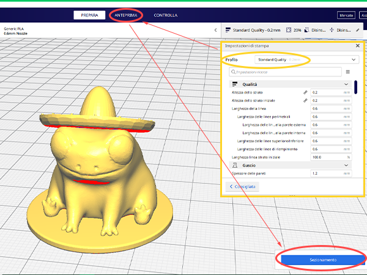

È ora possibile visualizzare l'anteprima di stampa e scorrere tra i __layers__ con il cursore a destra dello schermo. Verificate le impostazioni e il tempo di stampa segnato nella finestra in giallo, esportare il modello in formato Gcode, premendo il tasto _Salva su file_ e scegliendo la __Micro SD__ come destinazione.   
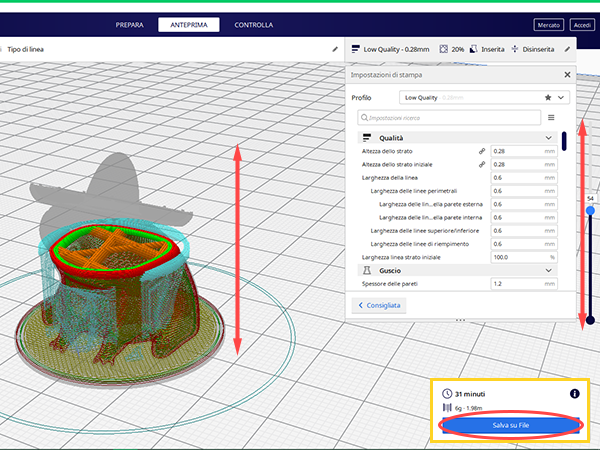
<!-- c`è un modo specifico per rinominare i file?? -->

### Accensione

Accendere la stampante 3D dal tasto posto sul lato posteriore della __Control box__.   
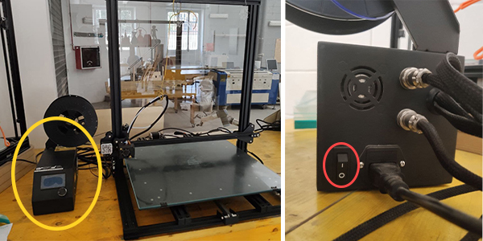

Ad avviamento completato comparirà la schermata principale, con le informazioni riportate di seguito:   
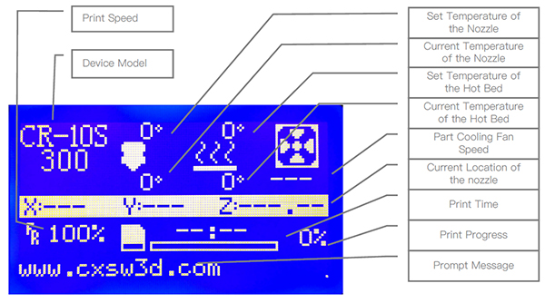

### Caricare la bobina di filamento

Per il caricamento del materiale bisogna come primo passo scaldare il __Nozzle__. Per farlo premere la __manopola di controllo__ (cerchiata in rosso) e accedere al menù pruncipale, quindi ruotarla fino a evidenziare la voce _Control_ e premere per conferma; ruotare ancora e premere per selezionare _Temperature_ e infine ripetere l'azione per selezionare _Nozzle_. Infine ruotare la rotella per alzare la __temperatura del Nozzle__ fino a 200°C.   
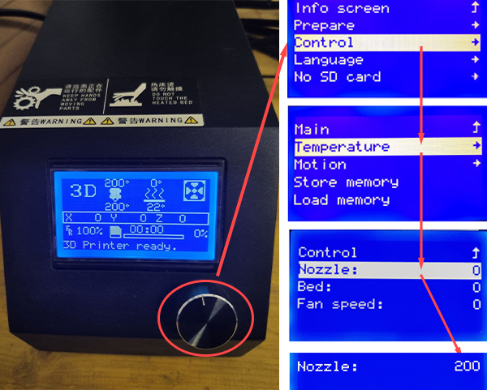

Scelto il filamento, appoggiare la bobina sullo __Spool holder__ (porta bobina) come mostrato in foto. Premere con due dita le leve dell'__estrusore__ e inserire il capo del filamento nel foro sul lato sinistro   
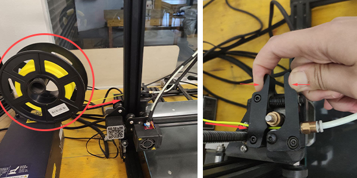

Inserito il filamento fino in fondo e riscaldato il nozzle, spingere il filo fino a farlo fuoriuscire dal nozzle e fino a che non avrà il colore del filamento che si intende utilizzare.   
Infone, per assicurare l'adesione al __piatto di stampa__, spruzzare una buona quantità di lacca sulla zona interessata

### Stampare

Inserire la __Micro SD__ contenente il file Gcode da stampare nella porta posta sul lato destro della __control box__, orientata come in figura.
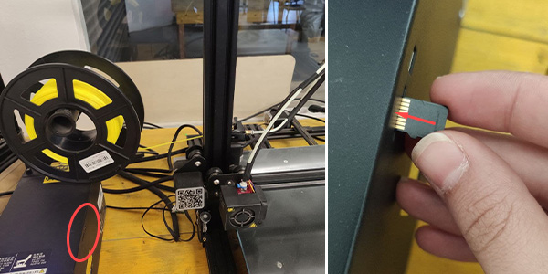

Selezionare quindi il file da stampare accedendo al menù principale (premere la __manopola di controllo__ evidenziata in rosso). Scorrere il menù fino alla voce _Print from TF_ o _Print from SD_ (in base alla stampante utilizzata), selezionare premendo e scegliere il file nella schermata successiva.
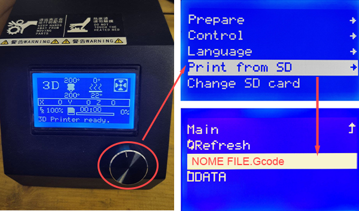

### Togliere la bobina di filamento

Come per la fase di [caricamento del materiale](#cambio-della-bobina-di-filamento), per la rimozione del materiale bisogna come primo passo scaldare il __Nozzle__.

Per rimuovere il filamento dalla macchina, a __Nozzle__ caldo, fare pressione con due dita sulle leve dell'__estrusore__ e spingere lievemente il filamento per appiattirne il capo. Quindi, tenendo sempre premute le leve, tirare il filamento e riarrotolarlo man mano sulla bobina per evitare.   
__ATTENZIONE!__ cercare di riarrotolare il più ordinatamente possibile il filamento sulla bobina, per evitare incidenti durante le stampe successive.
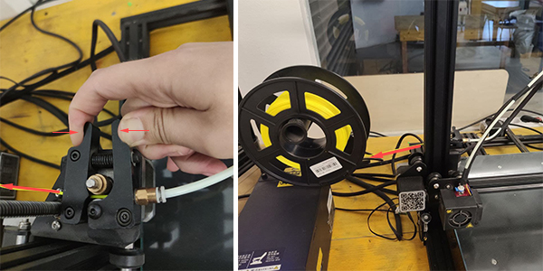

### Spegnimento 

Spegnere dunque la stampante 3D premendo lo stesso pulsante utilizzato nella [fase di accensione](#accensione)

## Post-processing

Finita la stampa, prendere la spatola e utilizzarla per scollare il pezzo dal piano di stampa, utilizzandola come in foto.
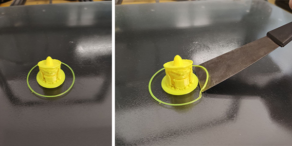

Pulire infine il pezzo da eventuali supporti o strutture di adesione al piatto (evidenziate nella foto a sinistra).
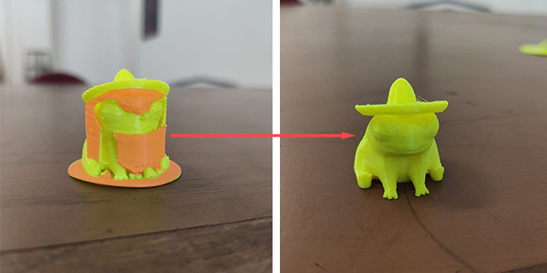

## FAQ
<!-- quali sono i problemi più frequenti? -->