# Fresatrice CNC

La [Fresatrice CNC](https://it.wikipedia.org/wiki/Fresatrice) è un macchinario sottrattivo a controllo numerico che utilizza una fresa per __asportare materiale nella quantità e forma richieste__. Questa tecnologia funziona applicando l'utensile all'albero della fresatrice e facendolo ruotare a varie velocità. I denti dotati di filo tagliente erodono e asportano il materiale seguendo un tracciato definito, permettedo di incidere, sagomare, tagliare e fresare una forma.

### Indice degli argomenti:
- [Applicazioni](#applicazioni)
- [Strumenti, materiali e file](#strumenti-materiali-e-file)
- [Processo di fresatura](#processo-di-fresatura)
- [Settare Z con il sensore Z0](#settare-punto-di-origine-z-con-il-sensore)
- 
- [FAQ](#faq)

## Applicazioni
La fresatura consente di ottenere una vasta gamma di superfici (piani, scanalature, spallamenti, forature ecc.) e le caratteristiche più importanti della lavorazione sono l'__elevata precisione__ e la __buona finitura superficiale__ del prodotto finito, infatti la precisione della fresatura può arrivare a tolleranze inferiori al micron ed è una lavorazione applicata in moltissimi settori industriali. Per le sue caratteristiche è ideale per la produzione di lotti di quantità limitata, prototipi o elementi progettati su misura, ma viene impiegata anche per fabbricare utensili utili in altri processi come ad esempio gli stampi tridimensionali. In virtù dell’elevata precisione la fresatura può essere impiegata come lavorazione secondaria su semilavorati ottenuti tramite un processo diverso.

Sono molti i materiali lavorabili per fresatura in modo sicuro e con risultati di alta qualità. In base al tipo di fresa è possibile lavorare materiali quali [schiume](http://www.chemix.it/it/poliuretaniche), gessi e stucchi, [cera da prototipazione](https://machinablewax.com/), [legno](https://www.leroymerlin.it/v3/search/search.do?keyword=legno) e [metalli leggeri e pesanti](https://it.misumi-ec.com/vona2/mech_material/M1401000000/M1401020000/#), anche per la creazione di [circuiti PCB](https://it.wikipedia.org/wiki/Circuito_stampato).

## Strumenti, materiali e file
Prima di iniziare assicurati di avere tutto il necessario:  
- Fresa CNC Roland Modela MDX-40A 
- Blocco iniziale da fresare  
- PC a lato macchina con installati i software necessari  
- File da fresare  
- Accessori   

### Roland Modela MDX-40A 

| Caratteristiche tecniche           | Valori                                   |   
|:-----------------------------------|:-----------------------------------------|     
| Velocità di esecuzione         | assi X-Y : 7-3000 mm/min, asse Z : 7-1800 mm/min                               |   
| Velocità di rotazione del mandrino       | 4,500-15,000 rpm                                   |   
| Risoluzione meccanica                | 0.002 mm/step                                |   
| peso massimo del materiale     | 4 kg                                    |      
| Grandezza massima area di fresatura   | 305x305x105 mm                              |         

Per ulteriori informazioni consultare la scheda tecnica sul [sito del rivenditore](https://www.rolanddga.com/support/products/milling/modela-mdx-40a-3d-milling-machine)

### Materiali lavorabili
La fresa Roland Modela è adatta alla fresatura di materiali quali il __legno__, la __cera da prototipazione__ e i __materiali plastici__. Il blocco di partenza deve avere misura massima di __300x300x100 mm__.   

### Caratteristiche delle end mills   
L'__end mill__ (utensile per la fresatura o fresa a candela) è un utensile da taglio che erode in direzione radiale il materiale. I vari utensili si distinguono tra di loro per diametro e lunghezze differenti, ma anche in base al numero di __lame__ che possiedono e al tipo di __punta__.   
    
In base al numero di lame (__flutes__), le __end mills__ si dividono in:

Invece, in base al tipo di __punta__, gli utensili si dividono principalmente in __flat__, __ball__ e __engraving tool__ (per le incisioni).
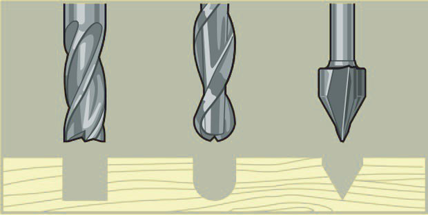

### PC con installati i software necessari
Al Fablab hai la possibilità di utilizzare il computer collegato alla Laser Cutter, nel quale sono già presenti i drivers e i software necessari.   
Il macchinario è compatibile con computer con sistemi operativi successivi a Windows Vista, equipaggiati con i software __VPanel__ e __SRP Player__.   

### File da fresare
Per fresare si parte da un modello 3D salvato in formato __STL__. Attraverso l'utilizzo di __SRP Player__ citato nella sezione [software necessari](#pc-con-installati-i-software-necessari) il file verrà convertito in __G CODE__ e preparato per la fresatura.

### Accessori
Gli oggetti esterni richiesti da questa lavorazione sono: un __piano sacrificale o martire__ e __biadesivo__ per il fissaggio del pezzo, l'__utensile__ adatto al materiale che si vuole fresare, due __chiavi inglesi misura 17 e 10__ per il fissaggio dell'utensile nel mandrino, il __sensore Z0__ in dotazione con il maccinario e __carta abrasiva__ nel caso di finiture finali.

## Processo di fresatura
Per fresare con la fresa CNC segui i passaggi illustrati di seguito.

### Accensione   
Accendere la ciabatta elettrica collegata alla macchina, quindi accendere anche il computer e lo schermo collegati alla fresa. 
La password del computer è _password_.     
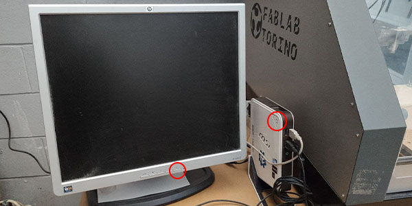

__ATTENZIONE!__ Prima di avviare la macchina assicurarsi che il piano di lavoro sia completamente sgombro e privo di ostacoli. Inoltre controllare che lo __sportello frontale__ sia chiuso.  

Accendere la macchina premendo il __main power switch__ (interruttore di alimentazione) presente sul retro del macchinario.   
Quindi accendere la fresa agendo sul  __pulsante di accensione__ presente nel __pannello di controllo__. La macchina eseguirà in automatico un auto home portando il __mandrino__ (spindle head) nel punto di origine della macchina.   
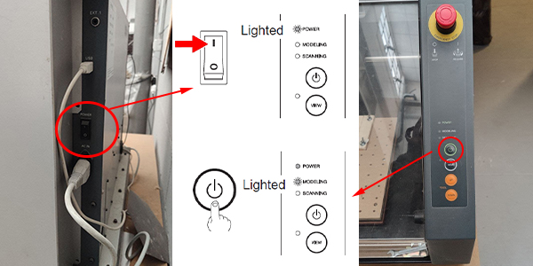

### Montare l'utensile
Scelto l'utensile più adatto al materiale e alla finitura che si vuole ottenere (per ulteriori informazioni sulle punte Roland consultare la [guida veloce alle frese](src/end_mill_guide.pdf)), fissarlo al mandrino utilizzando due chiavi inglesi da 10 e da 17, disponendole come in figura.   

### Preparare il piano martire e il materiale da fresare
Portare in avanti il piano di lavoro premendo il tasto _VIEW_ dal pannello di controllo. Su questo è generalmente fissato il __piano sacrificale__ (piano martire), un piano regolato secondo gli assi x-y del macchinario e che garantisce la perpendicolarità del pezzo rispetto al __mandrino__.      
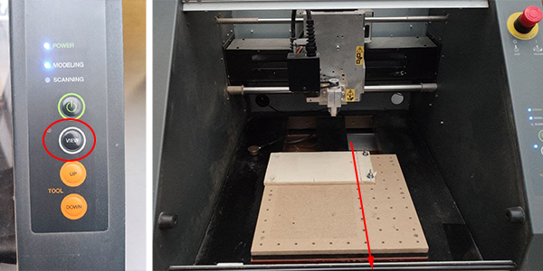

Fissare al __piano martire__ il pezzo da lavorare tramite __biadesivo__ (evidenziati in blu) o tramite __tasselli M6__ (corrispondenti al diametro dei fori del piano martire, cerchiati in rosso).   
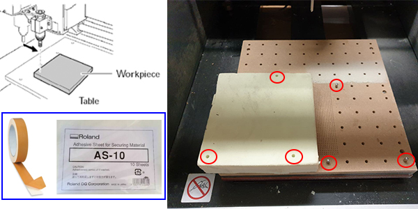

### Settare il punto di origine
Dal computer aprire il software __VPanel__. Controllare che il computer comunichi correttamente con la fresa, cliccando su _Setup_ e selezionando _Selected automatically_ nella finestra _Command Set_. Confermare cliccando su _OK_.   
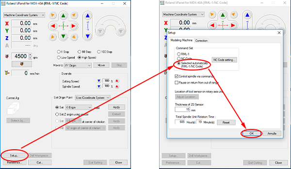

Per muovere manualmente il __mandrino__ si può utilizzare il set di frecce (evidenziato in giallo) presente sull'interfaccia di __VPanel__, dalle voci sotto (evidenziate in blu) si può impostare l'entità del movimento e la velocità di esecuzione. Inoltre nella colonna a sinistra vengono mostrate le coordinate relative dal __punto di origine__ selezionato  e dal _menù a tendina_ in alto si può scegliere un altro punto d'origine (questo set di comandi è evidenziato in verde).   
Per visualizzare una posizione specifica settata precedentemente, aprire il _menù a tendina_ di fianco alla voce _Move to_, selezionare quali coordinate si vogliono visualizzare e premere il tasto _Move_ (evidenziato in rosso).
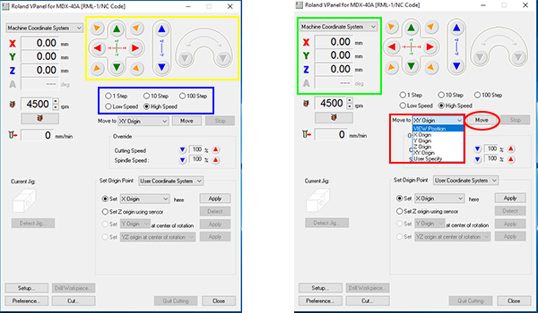
  
Per impostare un nuovo __punto di origine__ nella sezione _Set Origin Point_ scegliere dalla tendina la voce _User Coordinate System_ da modificare, spostare il mandrino nella posizione desiderata con le frecce già citate precedentemente. Selezionando l'opzione _Set X-Y Origin_ (cerchiato in rosso) e cliccando quindi sul tasto _Apply_ si impostano le coordinate degli assi x e y, si può fare lo stesso per l'asse z, selezionando _Set Z Origin_>_Apply_.   
In alternativa, per settare il punto z si può utilizzare il __sensore Z0__, vedere la [sezione dedicata](#settare-punto-di-origine-z-con-il-sensore).   
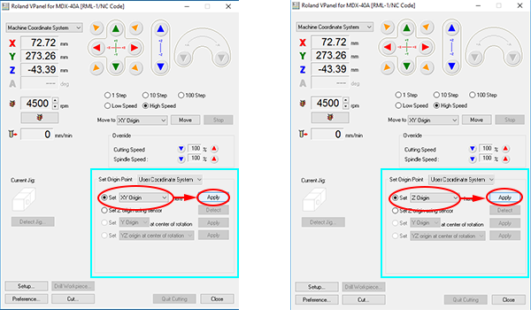

### Impostare l'utensile   
Dal Computer aprire il software __SRP Player__.   
Seguendo il percorso _File_>_Preferences_ è possibile modificare le impostazioni generali, delle unità di misura e dello schema colori. Cliccando sul tab _Advanced_ è possibile variare la precisione del percorso di fresatura (__Tool path Precision__ evidenziata in blu), scegliendo tra _Fine_, _Standard_ o _Coarse_ (ovvero Sgrossatura).
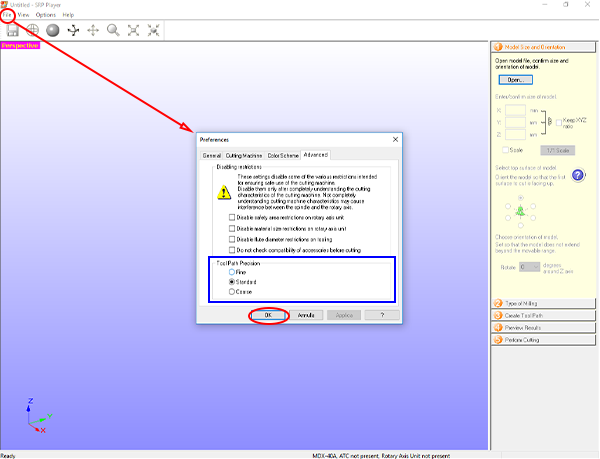

Nel caso si voglia utilizzare un utensile che non risulta in lista (visibile seguendo il percorso _Options_>_My Tools_), bisogna aggiungerlo da _Options_>_Add/Remove Tool..._ e aprendo così la finestra di dialogo in foto (percorso evidenziato in rosso).   
A questo punto si può selezionare un utensile simile e premere _Copy_, nella zona evidenziata in verde cambiare il nome in _Tool Name_ per evitare confusione e procedere quindi a impostare le caratteristiche proprie dell'utensile:

- in _Tool Type_ scegliere se la punta è flat, ball o engraving
- in _Material_ scegliere il materiale di cui è fatto l'utensile
- in _Flute Diameter_ e _Flute Lenght_ misurare e inserire le dimensioni dell'utensile, fare riferimento alla sezione [Caratteristiche delle End Mills](#caratteristiche-delle-end-mills) per eventuali dubbi riguardo le misure.   

Premere infine _Register_ per salvare l'utensile impostato.   
Se si vuole eliminare un utensile creato selezionarlo e premere _Delete_.
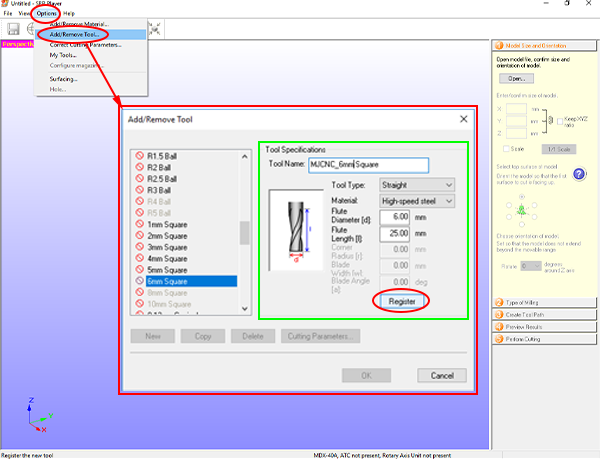

Rimanendo nella finestra di dialogo _Add/Remove Tool_, cliccare su _Cutting Parameters..._ per aprire una nuova finestra, evidenziata in rosso. Da qui è possibile cambiare il materiale che si ha intenzione di fresare e se necessario variare i parametri di taglio (evidenziati in verde, per maggiori informazioni a riguardo andare nella sezione [FAQ](#faq)).
Notare che cambiando il materiale da fresare, __SRP Player__ varia già i parametri, basandoli su punte similari a quella che si sta utilizzando.
Premere infine _Register_ e quindi _OK_ per chiudere entrambe le finestre di dialogo.
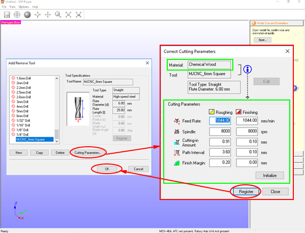

### Fare la spianatura del materiale
Prima di iniziare a impostare il file da fresare è bene __spianare__ il blocco di materiale che si intende utilizzare, assicurandosi di avere ogni punto della faccia superiore allineato.   
Da __SRP Player__ eseguire il percorso _Options_>_Surfacing_ aprendo la finestra di dialogo mostrata in foto. Selezionare dalla tendina _Material_ (in verde) il tipo di materiale che si sta per lavorare e da _Tool_ (in giallo) la punta che si utilizza per spianare. Quindi misurare la X e la Y del blocco e riportarla in mm (come evidenziato in blu).
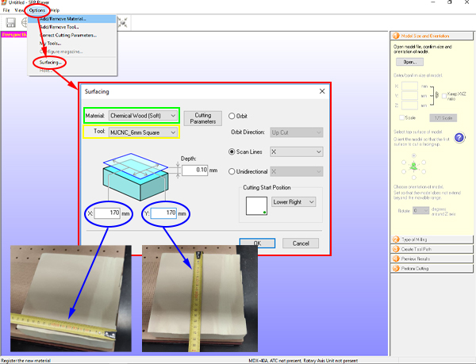

Misurare l'altezza del blocco nel punto più basso e inserire quanto lo si vuole scavare nel campo _Depht_ evidenziato in blu. Nella parte destra della finestra si può decidere come sarà lo spostamento del __surfacing__ (evidenziati in giallo, _scan lines_: l'utensile fresa con un movimento continuo; _Unidirectional_: l'utensile fresa solo in una direzione e poi fa uno spostamento per tornare indietro), qui ci sono anche le impostazioni di _Cutting Start Position_ (in verde) per decidere da che posizione inizierà la __spianatura__.
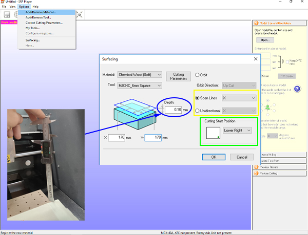

Premere ora su _Cutting Parameters_, facendo comparire una nuova finestra per poter modificare i parametri di taglio. Nello specifico, ci interessa avere il minor numero si passate per non impiegare troppo tempo a spianare il blocco. Andiamo quindi a modificare il campo _Cutting-in Amount_ evidenziato in verde: In questo caso vogliamo la spianatura di 5 mm, contando che non conviene avere il _Cutting-in Amount_ maggiore di 2.5 mm, avremo due soli passaggi di spianatura da 2.5 mm.
Premere quindi _OK_ e di nuovo _OK_.
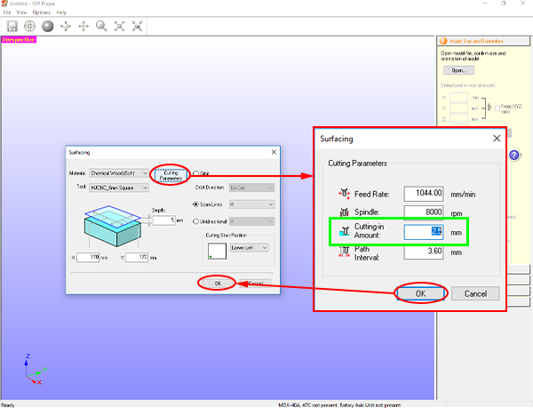

A questo punto si aprirà la finestra mostrata un foto. Selezionare uno dei due punti postu sul parallelepipedo azzurro, in base a dove è stato posizionato il punto di origine (in caso di dubbi, vedere la [sezione dedicata](#settare-il-punto-di-origine)), in questo caso il punto d'origine è sullo spigolo. Quindi flaggare la casella _Output to file_ e premere _Start Surfacing_. 
Se questo passaggio è andato a buon fine la macchina non inizierà a fare la spianatura ma si sarà generato un file .GCODE, in caso contrario __bloccare immediatamente la macchina!__
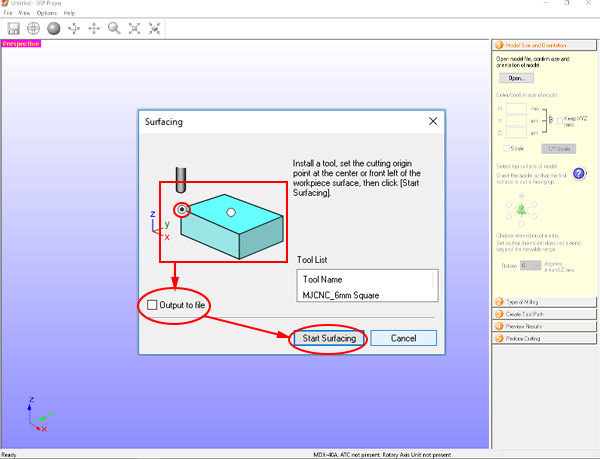

Aprire infine __VPanel__ e cliccare su _Cut.._. 
Nella nuova finestra premere _Add_ e scegliere il file .GCODE di spianatura dalla cartella di destinazione.
__ATTENZIONE!__ il software tiene in memoria le lavorazioni dell'ultima sessione, assicurarsi di cancellare le lavorazioni che non devono essere eseguite. Per farlo selezionare gli elementi da eliminare e selezionare _Delete_ (evidenziato in blu, nel caso si volessero eliminare tutte selezionare _Delete All_).
Dopo essersi assicurati che il punto d'origine sia settato e la lavorazione in lista sia solo la spianatura, Premere su _Output_ per far partire la fresatura.
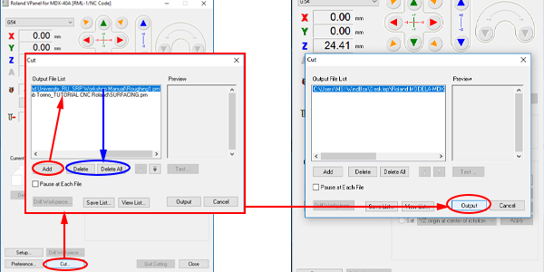

__ATTENZIONE!__ mai aprire lo sportello durante la lavorazione, o il macchinario eseguirà un arresto di emergenza. Se si vuole interrompere momentaneamente la lavorazione per controllare la fresatura o aspirare i residui, seguire le istruzioni riportate nella sezione [Controllare nel mezzo della lavorazione](#controllare-nel-mezzo-della-lavorazione).

__ATTENZIONE!__ pulire sempre il macchinario durante e dopo le lavorazioni, per evitare di accumulare troppa polvere che potrebbe costituire un rischio.
In laboratorio c'è un __aspiratore a bidone__ che deve essere utilizzato per aspirare i residui di lavorazione.
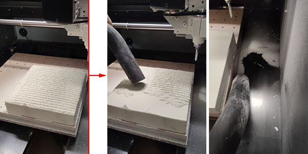

### Preparare il file
Importare il modello .STL su __SRP Player__ trascinandolo dalla cartella alla schermata del programma, oppure premendo _Open_ nella colonna a destra e selezionando il file nella cartella.

importato il modello controllare (e se necessario modificare) le dimensioni dal pannello a destra, evidenziato in -colore-. Sempre dalla colonna a destra è possibile ruotare il pezzo (comandi evidenziati in -colore-). Se si hanno dubbi riguardo l'esatto orientamento del pezzo, cliccare sul punto interrogativo blu per informazioni dettagliate.

per cambiare viste view e anche modi di visualizzare

type of milling - punto?blu
1-come elabora le curve, con che precisione
2-scegliere se è un modello molto organico o geometrico
3-scegliere se tagliare solo top o entrambi

type of material - dimensioni pezzo - punto?blu
scegliere materiali
scegliere grandezza del pezzo iniziale di materiale (con altezza dopo sainatura)
model placement

### Impostare i dettagli della fresatura
create tool path - edit
top surface>modelling> scegliere l'areadi lavoro > scegliere se si vuole un margine
partial area, se si vuole fresare solo una area
partial depth, selez flag per partire dal top
selez punta (impostata prima)
upcut o downcut - scegliere in base al materiale (es, venature legno)
cutting parameters - impostati prima, si possono cambiare -> qui c'è il margine da lasciare per il rough
infine create toolpath

dopo averlo calcolato si può vedere il percorso edit>icona blu in alto

modifiche per il roughing - surface - margins - partial area - partial depth - tool - process (sono sempre disponibili?) - parametri di taglio FAQ
modifiche per il finishing -> stesse possibilità, inserirle??

!pc fablab poco potente, per percorsi complessi usare un pc in grado di farlo

### Fresare
!aspirare le polveri e salvare!!

Preview results si può vedere tempo e prewiev taglio
per vedere solo uno dei processi da edit togliere il cutting al processo che non interessa

Perform cutting fare output to file>startcutting>selezione 0 -> fa un file per ogni lavorazione, rinominarlo con numerazione progressiva!!!
aprire VPANEL>rifare lo 0>cut>importare i file in ordine, scegliere se si deve fermare dopo ogni lavorazione(per cambio utensile)
si può salvare come lista per poterlo rifresare la prox volta
__ATTENZIONE!__ mai aprire lo sportello durante la lavorazione, o il macchinario eseguirà un arresto di emergenza.Se si vuole interrompere momentaneamente la lavorazione per controllare la fresatura o aspirare i residui, seguire le istruzioni riportate nella sezione [Controllare nel mezzo della lavorazione](#controllare-nel-mezzo-della-lavorazione).

__ATTENZIONE!__ pulire sempre il macchinario durante e dopo le lavorazioni, per evitare di accumulare troppa polvere che potrebbe costituire un rischio.
In laboratorio c'è un __aspiratore a bidone__ che deve essere utilizzato per aspirare i residui di lavorazione.
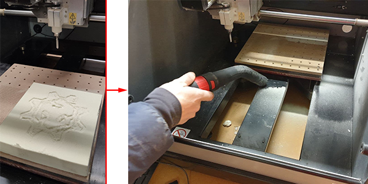

### Controllare nel mezzo della lavorazione
Per controllare come procede la lavorazione senza rischiare di compromettere il lavoro, premere il pulsante __VIEW__ e attendere che il macchinario finisca di lampeggiare. Quando il piano di lavoro sarà fermo e il led vicino al tasto __VIEW__ avrà smesso di lampeggiare, si può aprire il __vetro protettivo__.   

Per riportareil piano in posizione e far ripartire la lavorazione dal punto di interruzione, richiudere il __vetro protettivo__ e tenere premuto il tasto __VIEW__ per 3 secondi.

### Spegnimento 
Aspirare i residui sul pezzo e rimuovere il pezzo fresato facendo attenzione a non danneggiarlo.
Aspirare quindi anche il resto del macchinario con cura per evitare l'accumulo di polveri.

Per spegnere il macchinario chiudere il programma __VPanel__ da pc, quindi spegnere il macchinario dal __main power switch__ (interruttore di alimentazione) sul retro.
Spegnere il PC arrestando il sistema e lo schermo dall'apposito tasto. Spegnere infine la ciabatta elettrica collegata al macchinario.
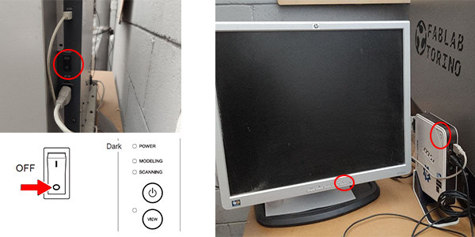

## Settare punto di origine Z con il sensore
Per settare il punto Z di origine con la massima precisione, si può utilizzare il __Sensore Z0__ abbinato al macchinario.   
Controllare che il sensore sia collegato alla fresa e disposto sul piano come da figure.   

Da __VPanel__, dopo aver settato le coordinate x e y seguendo la sezione [Settare il punto di origine](#settare-il-punto-di-origine) selezionare _Set Z origin using sensor_ e quindi cliccare su _Detect_.   
A questo punto l'utensile si abbasserà fino a toccare il __Sensore Z0__ e a definirne la posizione sull'asse Z.
Nella finestra di dialogo che compare premere __Continue__ e rimuovere il sensore dal piano di lavoro.   
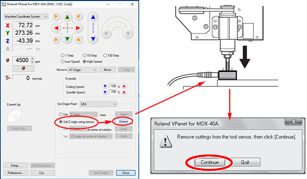

### modalità hole
da SRP, option>hole
scegliere tipo di pin, materiale e profondità

## FAQ
__Quali sono precisamente i parametri di taglio?__
•Feed Rate is the speed the tool is moving.
•Spindle speed is how fast the tool spinning Cutting-in Amount is spinning.
•Cutting in amount is the depth of cut for that tool.
•The Path interval is the distance between tool passes. Finishing passes are usually much smaller than roughing passes.

__Quali sono i limiti di una end mill?__   
Un utensile ha principalmente tre limiti di cui tenere conto:   
- non può fresare un foro o un particolare più piccolo del suo diametro.
- una fresa larga non può fresare angoli troppo acuti (minori di 90°) -> usare delle frese con diametro minore per rifinire gli angoli.
- non può fresare ad una profondità maggiore della sua lunghezza -> usare una fresa più lunga.

__Come scelgo il numero di lame di una end mill?__
Il numero di lame utili a fresare dipende dal tipo di materiale che si sta fresando e dalla lavorazione in corso. Alcuni esempi pratici:   
- un utensile a tre lame ha una maggiore resistenza meccanica rispetto ad uno con due lame.
- quattro o più lame sono ideali per lavori di finitura.

__come fare un foro__

