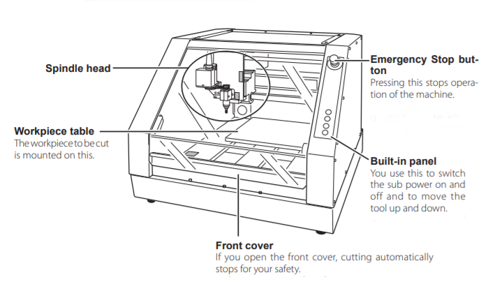
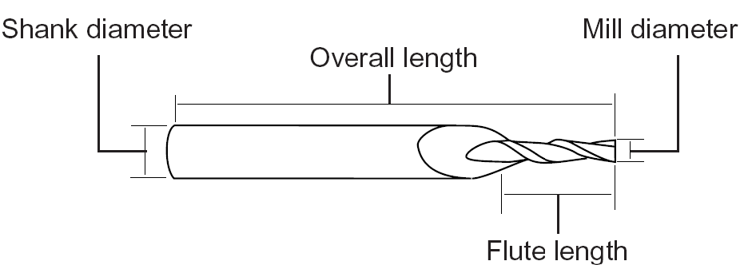
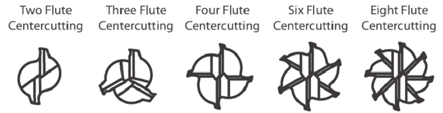
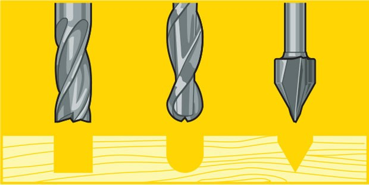
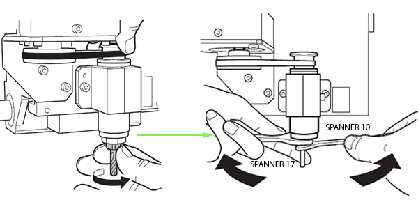
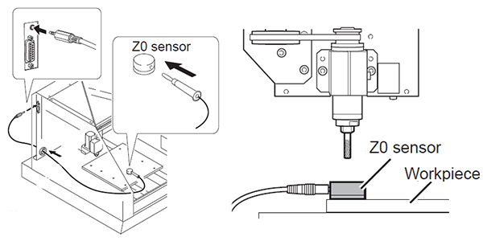

# Fresatrice CNC

La [Fresatrice CNC](https://it.wikipedia.org/wiki/Fresatrice) è un macchinario sottrattivo a controllo numerico che utilizza una fresa per __asportare materiale nella quantità e forma richieste__. Questa tecnologia funziona applicando l'utensile all'albero della fresatrice e facendolo ruotare a varie velocità. I denti dotati di filo tagliente erodono e asportano il materiale seguendo un tracciato definito, permettedo di incidere, sagomare, tagliare e fresare una forma.

### Indice degli argomenti:
- [Applicazioni](#applicazioni)
- [Strumenti, materiali e file](#strumenti-materiali-e-file)
- [Processo di fresatura](#processo-di-fresatura)
- [Settare Z con il sensore Z0](#settare-punto-di-origine-z-con-il-sensore)
- Spianatura piano martire
- [FAQ](#faq)

## Applicazioni
La fresatura consente di ottenere una vasta gamma di superfici (piani, scanalature, spallamenti, forature ecc.) e le caratteristiche più importanti della lavorazione sono l'__elevata precisione__ e la __buona finitura superficiale__ del prodotto finito, infatti la precisione della fresatura può arrivare a tolleranze inferiori al micron ed è una lavorazione applicata in moltissimi settori industriali. Per le sue caratteristiche è ideale per la produzione di lotti di quantità limitata, prototipi o elementi progettati su misura, ma viene impiegata anche per fabbricare utensili utili in altri processi come ad esempio gli stampi tridimensionali. In virtù dell’elevata precisione la fresatura può essere impiegata come lavorazione secondaria su semilavorati ottenuti tramite un processo diverso.

Sono molti i materiali lavorabili per fresatura in modo sicuro e con risultati di alta qualità. In base al tipo di fresa è possibile lavorare materiali quali [schiume](http://www.chemix.it/it/poliuretaniche), gessi e stucchi, [cera da prototipazione](https://machinablewax.com/), [legno](https://www.leroymerlin.it/v3/search/search.do?keyword=legno) e [metalli leggeri e pesanti](https://it.misumi-ec.com/vona2/mech_material/M1401000000/M1401020000/#), anche per la creazione di [circuiti PCB](https://it.wikipedia.org/wiki/Circuito_stampato).

## Strumenti, materiali e file
Prima di iniziare assicurati di avere tutto il necessario:  
- Fresa CNC Roland Modela MDX-40A 
- Blocco iniziale da fresare  
- PC a lato macchina con installati i software necessari  
- File da fresare  
- Accessori   

### Roland Modela MDX-40A 

| Caratteristiche tecniche           | Valori                                   |   
|:-----------------------------------|:-----------------------------------------|     
| Velocità di esecuzione         | assi X-Y : 7-3000 mm/min, asse Z : 7-1800 mm/min                               |   
| Velocità di rotazione del mandrino       | 4,500-15,000 rpm                                   |   
| Risoluzione meccanica                | 0.002 mm/step                                |   
| peso massimo del materiale     | 4 kg                                    |      
| Grandezza massima area di fresatura   | 305x305x105 mm                              |         

Per ulteriori informazioni consultare la scheda tecnica sul [sito del rivenditore](https://www.rolanddga.com/support/products/milling/modela-mdx-40a-3d-milling-machine)

### Materiali lavorabili
La fresa Roland Modela è adatta alla fresatura di materiali quali il __legno__, la __cera da prototipazione__ e i __materiali plastici__. Il blocco di partenza deve avere misura massima di __300x300x100 mm__.   

### caratteristiche delle end mills   
L'__end mill__ (utensile per la fresatura o fresa a candela) è un utensile da taglio che erode in direzione radiale il materiale. I vari utensili si distinguono tra di loro per diametro e lunghezze differenti, ma anche in base al numero di __lame__ che possiedono e al tipo di __punta__.   
    
In base al numero di lame (__flutes__), le __end mills__ si dividono in:

Invece, in base al tipo di __punta__, gli utensili si dividono principalmente in __flat__, __ball__ e __engraving tool__ (per le incisioni).

### PC con installati i software necessari
Al Fablab hai la possibilità di utilizzare il computer collegato alla Laser Cutter, nel quale sono già presenti i drivers e i software necessari.   
Il macchinario è compatibile con computer con sistemi operativi successivi a Windows Vista, equipaggiati con i software __VPanel__ e __SRP Player__.   

### File da fresare
Per fresare si parte da un modello 3D salvato in formato __STL__. Attraverso l'utilizzo di __SRP Player__ citato nella sezione [software necessari](#pc-con-installati-i-software-necessari) il file verrà convertito in __G CODE__ e preparato per la fresatura.

### Accessori
Gli oggetti esterni richiesti da questa lavorazione sono: un __piano sacrificale o martire__ e __biadesivo__ per il fissaggio del pezzo, l'__utensile__ adatto al materiale che si vuole fresare, due __chiavi inglesi misura 17 e 10__ per il fissaggio dell'utensile nel mandrino, il __sensore Z0__ in dotazione con il maccinario e __carta abrasiva__ nel caso di finiture finali.

## Processo di fresatura
Per fresare con la fresa CNC segui i passaggi illustrati di seguito.

### Accensione   
Accendere la ciabatta elettrica collegata alla macchina, quindi accendere anche il computer e lo schermo collegati alla fresa. 
La password del computer è _password_.     

__ATTENZIONE!__ Prima di avviare la macchina assicurarsi che il piano di lavoro sia completamente sgombro e privo di ostacoli. Inoltre controllare che lo __sportello frontale__ sia chiuso.   
Accendere la macchina premendo il __main power switch__ (interruttore di alimentazione) presente sul retro del macchinario.

Quindi accendere la fresa agendo sul  __pulsante di accensione__ presente nel __pannello di controllo__. La macchina eseguirà in automatico un auto home portando il __mandrino__ (spindle head) nel punto di origine. <!--in che punto di origine? quello assoluto o l'ultimo settato?-->
<!--accendere fresa fronte - homing-->

### Montare l'utensile
Scelto l'utensile più adatto al materiale e alla finitura che si vuole ottenere (per ulteriori informazioni sulle punte Roland consultare la [guida veloce alle frese](src/end_mill_guide.pdf)), fissarlo al mandrino utilizzando due chiavi inglesi da 10 e da 17, disponendole come in figura.   

### Preparare il piano martire e il materiale da fresare
Portare in avanti il piano di lavoro premendo il tasto _VIEW_ dal pannello di controllo. Su questo è generalmente fissato il __piano sacrificale__ (piano martire, cerchiato in -colore-), un piano regolato secondo gli assi x-y del macchinario e che garantisce la perpendicolarità del pezzo rispetto al __mandrino__.   
Se il __piano martire__ non è regolare, vedere la sezione [spianatura del piano martire](#spianatura-del-piano-martire).   

Fissare al __piano martire__ il pezzo da lavorare tramite __biadesivo__ o tramite __tasselli M6__ (corrispondenti al diametro dei fori del piano martire).

Tenere premuto per 3 secondi il tasto _VIEW_ per far tornare il piano di lavoro alla posizione per la lavorazione.
   

### Settare il punto di origine
Dal computer aprire il software __VPanel__. Controllare che il computer comunichi correttamente con la fresa, cliccando su _Setup_ e selezionando _Selected automatically_ nella finestra _Command Set_. Confermare cliccando su _OK_.   

Per muovere manualmente il __mandrino__ si può utilizzare il set di frecce (cerchiato in -colore-) presente sull'interfaccia di __VPanel__. Dalle voci sotto (cerchiate in -colore-) si può impostare l'entità del movimento e la velocità di esecuzione, inoltre nella colonna a sinistra vengono mostrate le coordinate relative al __punto di origine__ selezionato (dal _menù a tendina_ evidenziata in -colore- si può scegliere un altro punto d'origine).   

Per visualizzare una posizione specifica settata precedentemente, aprire il _menù a tendina_ di fianco alla voce _Move to_ e premere il tasto _Move_.   
Per impostare un nuovo __punto di origine__ nella sezione _Set Origin Point_ scegliere la voce da modificare (__ATTENZIONE!__ non modificare le impostazioni _Machine Coordinate System_), spostare il mandrino nella posizione desiderata con le frecce già citate precedentemente. Selezionando l'opzione _Set X-Y Origin_ (cerchiato in -colore-) e cliccando quindi sul tasto _Apply_ si impostano le coordinate degli assi x e y, si può fare lo stesso per l'asse z, selezionando _Set Z Origin_>_Apply_.   
In alternativa, per settare il punto z si può utilizzare il __sensore Z0__, vedere la [sezione dedicata](#settare-punto-di-origine-z-con-il-sensore).   

### Preparare il file   
Dal Computer aprire il software __SRP Player__.
add material e tool
type of milling
type of material

### Partizione e simulazione della fresatura
create tool path

### Fresare
__ATTENZIONE!__ mai aprire lo sportello durante la lavorazione, o il macchinario eseguirà un arresto di emergenza.

### Controllare nel mezzo della lavorazione
Per controllare come procede la lavorazione senza rischiare di compromettere il lavoro, premere il pulsante __VIEW__ e attendere che il macchinario finisca di lampeggiare. Quando il piano di lavoro sarà fermo e il led vicino al tasto __VIEW__ avrà smesso di lampeggiare, si può aprire il __vetro protettivo__.   

Per riportareil piano in posizione e far ripartire la lavorazione dal punto di interruzione, richiudere il __vetro protettivo__ e tenere premuto il tasto __VIEW__ per 3 secondi.

### Spegnimento 
Per spegnere il macchinario chiudere il programma __VPanel__ da pc, quindi spegnere il macchinario dal __main power switch__ (interruttore di alimentazione) sul retro.

## Settare punto di origine Z con il sensore
Per settare il punto Z di origine con la massima precisione, si può utilizzare il __Sensore Z0__ abbinato al macchinario.   
Controllare che il sensore sia collegato alla fresa e disposto sul piano come da figure.   

Da __VPanel__, dopo aver settato le coordinate x e y seguendo la sezione [Settare il punto di origine](#settare-il-punto-di-origine) selezionare _Set Z origin using sensor_ e quindi cliccare su _Detect_.   
   

A questo punto l'utensile si abbasserà fino a toccare il __Sensore Z0__ e a definirne la posizione sull'asse Z.
Nella finestra di dialogo che copare premere __Continue__ e rimuovere il sensore dal piano di lavoro.

## Spianatura del piano martire

## FAQ
