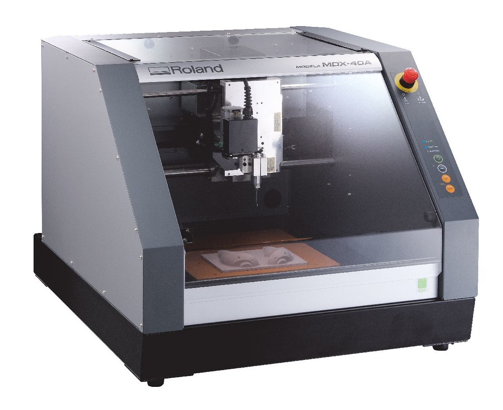

# Fresatrice CNC

La [Fresatrice CNC](https://it.wikipedia.org/wiki/Fresatrice) è un macchinario a controllo numerico che utilizza una fresa per asportare materiale nella quantità e forma richieste. Questa tecnologia funziona applicando l'utensile all'albero della fresatrice e facendolo ruotare a varie velocità. I denti dotati di filo tagliente erodono e asportano il materiale seguendo un tracciato definito, permettedo di incidere, sagomare, tagliare e fresare una forma.

### Indice degli argomenti:
- [Applicazioni](#applicazioni)
- [Strumenti, materiali e file](#strumenti-materiali-e-file)
- [impostazione del punto di origine](#impostazione-del-punto-di-origine)
- [Processo di fresatura](#processo-di-fresatura)
- [FAQ](#faq)

## Applicazioni
La fresatura consente di ottenere una vasta gamma di superfici (piani, scanalature, spallamenti, forature ecc.) e le caratteristiche più importanti della lavorazione sono l'elevata precisione e la buona finitura superficiale del prodotto finito, infatti la precisione della fresatura può arrivare a tolleranze inferiori al micron ed è una lavorazione applicata in moltissimi settori industriali. Per le sue caratteristiche è ideale per la produzione di lotti di quantità limitata, prototipi o elementi progettati su misura, ma viene impiegata anche per fabbricare utensili utili in altri processi come ad esempio gli stampi tridimensionali. In virtù dell’elevata precisione la fresatura può essere impiegata come lavorazione secondaria su semilavorati ottenuti tramite un processo diverso.

Sono molti i materiali lavorabili per fresatura in modo sicuro e con risultati di alta qualità. In base al tipo di fresa è possibile lavorare materiali quali [schiume](http://www.chemix.it/it/poliuretaniche), gessi e stucchi, [cera da prototipazione](https://machinablewax.com/), [legno](https://www.leroymerlin.it/v3/search/search.do?keyword=legno) e [metalli leggeri e pesanti](https://it.misumi-ec.com/vona2/mech_material/M1401000000/M1401020000/#), anche per la creazione di [circuiti PCB](https://it.wikipedia.org/wiki/Circuito_stampato).

## Strumenti, materiali e file
Prima di iniziare assicurati di avere tutto il necessario:  
- Fresa CNC Roland Modela MDX-40A 
- Blocco iniziale da fresare  
- PC a lato macchina con installati i software necessari  
- File da fresare  
- Accessori (utensili da fresa, piano di fissaggio)  

### Roland Modela MDX-40A
   

| Caratteristiche tecniche           | Valori                                   |   
|:-----------------------------------|:-----------------------------------------|     
| Velocità di esecuzione         | XY-axis : 7 to 3000 mm/min, Z-axis : 7 to 1800 mm/min                               |   
| Velocità di rotazione del mandrino       | 4,500 to15,000 rpm                                   |   
| Risoluzione meccanica                | 0.002 mm/step                                |   
| peso massimo del materiale     | 4 kg                                    |      
| Grandezza massima area di fresatura   | 305x305x105 mm                              |         

Per ulteriori informazioni consultare la scheda tecnica sul [sito del rivenditore](https://www.rolanddga.com/support/products/milling/modela-mdx-40a-3d-milling-machine)

### Materiali lavorabili
La fresa Roland Modela è adatta alla fresatura di materiali quali il legno, la cera da prototipazione e i materiali plastici. Il blocco di partenza deve avere misura massima di 300x300x100 mm.   

### PC con installati i software necessari
Al Fablab hai la possibilità di utilizzare il computer collegato alla Laser Cutter, nel quale sono già presenti i drivers e i software necessari.   
Il macchinario è compatibile con computer con sistemi operativi successivi a Windows Vista, equipaggiati con i software __VPanel__ e __SRP Player__.   

### File da tagliare
Le lavorazioni della Laser Cutter si basano su tracciati vettoriali, perciò il file utilizzato deve contenere contorni definiti e privi di doppie linee e riempimenti.   
Il software __Lasercut 6.1__ supporta file di formato DXF (si consiglia il DXF 2000/LT2000).   
<!-- controllare che ai e jpg funzionino, bpm funziona? -->

### Accessori
Gli oggetti esterni richiesti da questa lavorazione sono: delle barre di ferro per evitare l'imbarcamento del pezzo da tagliare, un fondale rigido in [metallo alveolare](https://www.cel.eu/it/prodotti/alveolari/alluminio) per supportare i materiali poco rigidi. In alcuni casi potrebbe servire anche un taglierino (o Cutter) per aiutare la separazione dei pezzi.   

## Impostazione del punto di origine

## Processo di fresatura
Per tagliare con la Laser Cutter segui i passaggi illustrati di seguito.   

### Accensione
Accendere la ciabatta elettrica collegata alla macchina, quindi accendere anche il computer e lo schermo alla destra della Laser Cutter.   

Accendere il refrigeratore (__Chiller__) a sinistra della macchina dallo switch posteriore.   

__ATTENZIONE!__ Prima di avviare la macchina assicurarsi che il piano di lavoro sia completamente sgombro e privo di ostacoli.    
Accendere quindi la macchina girando in senso orario la chiave dell'__interruttore generale__, sopra il __pannello di controllo__. Appena dopo l'accensione l'ugello si posizionerà automaticamente nell'angolo in alto a destra del piano, come mostrato in foto.   

### Preparare il file   
Inserire la chiavetta USB contenente il file e avviare __Lasercut 6.1__.   
Per aprire il file vettoriale premere _CTRL+I_ oppure seguire il percorso _File_>_Importa_>selezionare il file.   

È possibile muovere il soggetto trascinandolo dalla _X_ blu posta al suo centro e ruotarlo utilizzando l'icona a sinistra raffigurante una freccia. Si può inoltre scalarlo utilizzando il comando nella colonna a sinistra raffigurante un rettangolo quotato.   

È consigliato avere un file di taglio composto da linee continue e non frammentate. Per unire automaticamente dei segmenti vicini selezionare le linee e seguire il percorso _Strumenti_>_Unisci Linee_> nella finestra di dialogo inserire distanza massima tra le linee da unire >_Ok_.
 

Inoltre, avere doppie linee nel file potrebbe creare problemi o allungare i tempi durante il taglio. È perciò consigliato eseguire un controllo delle doppie linee seguendo il percorso _Strumenti_>_Cancella Linee Sovrapposte_, il programma selezionerà tutte le linee sovrapposte e basterà premere il tasto _CANC_ per eliminarle.   

Dalla colonna a destra è possibile dividere le linee dell'oggetto in base a diversi __profili di taglio o incisione__. Selezionando la linea da isolare [1] e assegnandole un colore dalla barra in basso [2], il programma la inserisce in un profilo di taglio separato e modificabile in modo individuale [3].   
Con i tasti _Sposta Su_ e _Sposta Giù_ si possono ordinare i colori in base all'ordine di esecuzione desiderato.  

Assegnate le varie linee ai __profili di taglio o incisione__, facendo doppio click sui colori dei profili si possono impostare le caratteristiche in base al tipo di lavorazione desiderata. Nelle immagini di seguito, sono evidenziate in giallo le voci da modificare per le __lavorazioni di taglio e raster__.   
__Attenzione!__  non modificare gli altri parametri!

Controllare sempre dove è il __punto di origine del taglio__, segnato con un pallino blu. È possibile modificarne la posizione premendo il comando in alto e scegliendo la posizione desiderata dalla finestra di dialogo, premere infine _Ok_ per confermare.

Per inviare il file al macchinario si deve seguire il percorso _Download_>_Download File Corrente_>scegliere un nome, infine confermare l'azione.   

### Caricare il materiale 
Aprire quindi il __coperchio__ del macchinario per inserire il materiale da tagliare e incidere.     
Assicurarsi che le __doghe__ di ferro del macchinario siano ben disposte e nel caso di un materiale morbido (come il tessuto o la carta) aggiungere il piano in __metallo alveolare__.   
Bloccare quindi il materiale utilizzando le __sbarre di ferro__ (poste a lato della macchina) come pesi. Assicurarsi infine che il materiale sia stabile, tamburellando lievemente per sentire se ci sono parti imbarcate.   
__ATTENZIONE!__ assicurarsi che la __griglia dell'aspiratore__ (in rosso) sia pulita!   

La forma conica del laser richiede anche una regolazione dell'asse z.   
Muovere il piano dal __pannello di controllo__ premendo il tasto `Z` e poi le freccie `↑` e `↓`, posizionandolo il più in alto possibile senza danneggiare il __cannone del laser__. Quindi regolare la distanza tra il materiale e la punta del cannone utilizzando il blocchetto di legno (in genere appoggiato vicino al pannello di controllo). La misura adatta si ha quando il blocchetto è libero di passare tra i due ma sfiorandoli.   
Infine premere il tasto `Z` per uscire dalla selezione.

### Tagliare
Prima di procedere al taglio è buona pratica fare dei test. Premere il tasto `Esc` per uscire dalla selezione, poi tramite i tasti `↑`, `↓`, `←` e `→` posizionare la testina contenente il laser sul materiale. Quindi premere il tasto `Test` e osservare se l'area descritta dalla testina rientra completamente nel materiale.   
Per un'ulteriore conferma si può verificare l'esatta posizione del punto di partenza del laser. A __coperchio__ chiuso e __testina__ nella posizione desiderata, premere brevemente il tasto `Laser` per emettere un raggio e segnare il punto di partenza.   

Ricordarsi sempre di accendere l'__aspiratore__ dallo switch posto dietro al computer (in foto).   

Si può quindi avviare il macchinario premendo il tasto `Start/Pause` sul __pannello di controllo__. Mentre la Laser Cutter esegue il taglio bisogna controllare che la pressione indicata sia a 2, se necessario modificarla agendo sulla __valvola__ indicata in foto.   

A taglio e incisione terminati premere `Datum` sul __pannello di controllo__ per inviare la testina nell'angolo in alto a destra.   
Si può quindi prelevare il materiale dal macchinario e separare e rimuovere i pezzi in eccesso.   

### Spegnimento 
Finito il processo si può spegnere l'__aspiratore__, se invece non si utilizza più il macchinario si deve spegnere anche il __Chiller__ e la Laser Cutter, girando la chiave di __avviamento__.   

Spegnere infine anche il Computer, il monitor e infine anche la ciabatta elettrica posizionata dietro, visibile nella [fase di accensione](#accensione).   

## FAQ
__Perchè non posso tagliare il PVC?__   
Il PVC non è adatto per l'incisione o il taglio laser a causa di sostanze specifiche che contiene e la formazione di acido cloridrico e gas velenosi.