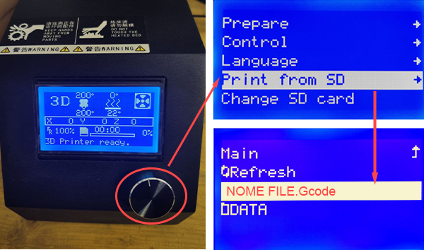

# 3D Printer

With [3D printing] (https://en.wikipedia.org/wiki/3D_printing) we mean the creation of three-dimensional objects by additive manufacturing, starting from a digital 3D model.
3D printers uses different technologies for production, the most common is [FDM (Fused Deposition Modeling) technology] (https://en.wikipedia.org/wiki/Fused_filament_fabrication#Fused_deposition_modeling). This technology works on an "additive" principle by releasing the material layer over layer. A thermoplastic filament is unwound from a spool, which supplies the material to an extrusion nozzle, which is heated to melt the material and can be guided both horizontally and vertically by a numerically controlled mechanism.

## Index of topics:
- [Applications](#applications)
- [Tools, materials and files](#tools-materials-and-files)
- [Print process](#print-process)
- [Post-processing](#post-processing)
- [Bed leveling](#bed-leveling)
- [FAQ](#faq)

## Applications

The 3D printing technology allows you to efficiently create unique pieces and extremely complex geometries, not achievable otherwise. For this reason, its applications are many and continuously growing, from the creation of prototypes, customized medical prostheses and orthoses, but also used in the most diverse industrial sectors: aerospace, automotive, food, construction, medical and biomedical sectors.

Depending on the type of 3D printing technology, the usable materials also change.
With FDM technology it is possible to process thermoplastic polymers ([PLA](https://www.3ditalyshop.it/prodotti/filamenti/1-75/pla_1-75/), [ABS](https://www.3ditalyshop.it/prodotti/filamenti/1-75/abs_1.75/), [Nylon](https://www.3djake.it/filamenti-per-stampanti-3d/filamenti-di-nylon), [PETG](https://www.3ditalyshop.it/prodotti/filamenti/1-75/pet_1.75/), [PVA](https://www.3ditalyshop.it/prodotti/filamenti/1-75/pva-1.75/)), thermoplastic ([TPU](https://www.3ditalyshop.it/prodotti/filamenti/1-75/tpu-98a-1-75/)), polymeric ([PEEK](https://www.3djake.it/filamenti-per-stampanti-3d/filamenti-peek-per-stampanti-3d-fdm), [PEI](https://www.3djake.it/filamenti-per-stampanti-3d/pei-ultem)), but also composite materials consisting of a polymeric matrix and loaded with fibers or with metal filler (these require a post sintering process in which the thermoplastic matrix evaporates leaving only the metal parts).

## Tools, materials and files
Before starting, check the list:
- 3D printer
- Filament spool
- PC with the necessary software installed
- File to print
- Accessories

### 3D printer Creality CR-10 S
<!-- questa immagine è fuori misura -->
 

| Technical features | Values |
|: ----------------------------------- |: ----------- ------------------------------ |
| Maximum print size | 300 x 300 x 400 mm |
| Mounted nozzle | 0.4 mm |
| Thickness of the layer | 0.1 - 0.32 mm |
| Printing accuracy | ± 0.1 mm |
| Filament diameter | 1.75 mm |
| Maximum plate temperature | 100 ℃ |
| Maximum nozzle temperature | 250 ℃ |
| Maximum print speed | 180 mm / s                                |   
   
   
### 3D printer Creality CR-10 S5

   

| Technical features | Values |
|: ----------------------------------- |: ----------- ------------------------------ |
| Maximum print size | 500 x 500 x 500 mm |
| Thickness of the layer | 0.1 - 0.48mm |
| Mounted nozzle | 0.6 mm |
| Printing accuracy | ± 0.1 mm |
| Filament diameter | 1.75 mm |
| Maximum plate temperature | 60 ℃ |
| Maximum nozzle temperature | 250 ℃ |
| Maximum print speed | 180 mm / s | 

For further information on the Creality CR-10 line, consult the [data sheet](src/cr10-user-manual.PDF)

### Plastic filament
The materials are commonly marketed in the form of filament spools or pellets.
Fablab printers use filaments of [PLA with a diameter of 1.75 mm](https://www.3ditalyshop.it/prodotti/filamenti/1-75/pla_1-75/), available in many colors and easy to work with.

### PC with the necessary software installed
For the [slicing](https://it.wikipedia.org/wiki/Slicing) and printing settings it is necessary to have the [__Ultimaker Cura__](https://ultimaker.com/it/software/ultimaker-cura).
To send the file to the printing stage, you can use the __Control Box__ connected to each printer and positioned on the left of the printing bed.

### File to print
The 3D printer works with 3d files.
The __Ultimaker Cura__ software supports 3D models in 3MF, AMF, DAE, ZAE, CTM, STL, PLY, OBJ, X3D, GBL, GLTF and GCODE formats.

### Accessories
During processing, external objects must also be used: the hair spray must be applied to the __glass plate__ of the printer before starting printing, to ensure firm adhesion of the pieces; the cutters are used to cut the filament when loading or removing the material; the tweezers are for removing filament burrs during the heating phase of the __nozzle__; the spatula is needed to detach the printed piece from the plate at the end of the process.

## Printing process

To 3D print please follow the steps below.

### Print parameters

Start the __Ultimaker Cura__ software on your PC and set up the printer you intend to use. If this is the first time the program is started, the selection of a printer will be in the initial configuration, otherwise, instead, follow the path _Printer selection panel_ > _Add printer_ > select the printer from the list > _Add_.
  

A further window will then open, it is always good to check that the information coincides with the technical tables shown in the [sections dedicated to the two printers](#3d-printer-creality-cr-10-s). Then press _Next_ to confirm.

You'll need to change the nozzle parameter on the software based on the diameter of the __Nozzle__ mounted on the printer and the type of material you're going to use (at Fablab you only use [PLA or PLA +](#filament-spool)), the size of the nozzle is shown in the [technical tables of the two printers](#3d-printer-creality-cr-10-s) and the value is entered on __Ultimaker Cura__ as indicated in red in the image below.

### Slicing

The model to be printed can be created using modeling software or downloaded from the internet (some of the best known repositories: [Thingiverse](https://www.thingiverse.com/), [MyMiniFactory](https://www.myminifactory.com/), [Yeggi](https://www.yeggi.com/), [PrusaPrinters](https://www.prusaprinters.org/prints)).  
To open the model on __Ultimaker Cura__ follow the path _File_ > _Open file ..._ > select the model.

It is possible to make some basic modifications to the model directly from the software: using the icons on the left  it is possible to move, scale and rotate the model according to the three axes.

Once the model has been imported, a curtain on the right of the screen will show all the possible profile for printing (eg __nozzle temperature__, __plate temperature__, __movement speed__), which can be modified.
However, the program also offers __predefined print profiles__ which should give good results.
After you have set all the variables, or just selected a profile, change the tab by pressing on _PREVIEW_ and start slicing with the _SLICING_ key.

You can now view the print preview and scroll through the __layers__ with the cursor to the right of the screen. Check the settings and the print time marked in the yellow window on the bottom right and then export the model in Gcode format, pressing the _Save to file_ button and choosing the __Micro SD__ as destination.

<!-- c`è un modo specifico per rinominare i file?? -->

### Power on

Turn on the 3D printer from the button on the rear side of the __Control box__.

When startup is complete, the main page will appear on the screen, with the following information:

### Load the filament spool
To load the material, the first step is to heat the __Nozzle__ using the __Control Box__.
Access the main menu by pressing the __control knob__ (circled in red), the first item of each menu is used to return to the previous screen. Turn the knob clockwise or counterclockwise to move between the menu items and press it to confirm.
Heat the nozzle by selecting the menu items in this order:

_Control_ > _Temperature_ > _Nozzle_ 

Finally, turn the wheel to raise the __temperature of the Nozzle__ up to 200°C and wait for it to heat up.

Once the filament has been chosen, place the spool on the __Spool holder__ as shown in the photo. Press the levers of the __ extruder__ with two fingers and insert the end of the filament into the hole on the left side.
__WARNING!__ check that the filament is sufficient for printing the file! To know the steps, read the [dedicated section](#check-that-the-filament-is-enough-for-printing)

After the filament is inserted and the nozzle heated, push the filament until it comes out of the nozzle and until it has the color of the filament you intend to use.
Finally, hair spray is an excellent fixative to ensure adhesion to the __printing plate__ of the first layers, spray it on the affected area of the plate.
__WARNING!__ when applying the hair spray on the plate, be careful not to spray it on the movable guides and on the nozzle, in order to avoid damaging them.

### Printing

Insert the __Micro SD__ containing the Gcode file to be printed in the port located on the right side of the __control box__, oriented as in the figure.

Then select the file to be printed by accessing the main menu (press the __control knob__ highlighted in red). Scroll the menu to _Print from TF_ or _Print from SD_ (depending on the printer used), select by pressing and choose the file in the next screen.

Once printing has started, check the execution of the first layer to make sure that there is the right adhesion and that the [bed-leveling](#bed-leveling) is correct.
The image below shows the effects of different adhesion on the first print layer.

### Remove the filament spool

As for the phase of [loading the material](#change-of-the-filament-spool), for the removal of the material it is necessary as a first step to heat the __Nozzle__ to about 200°C and wait for it to reach temperature.

Before removing the filament from the machine, when the __Nozzle__ is hot, it is advisable to slightly flatten the initial part of the filament, in order to make it easier to extract and reinsert it. Then press with two fingers on the levers of the __extruder__ and push the filament in. Then, always keeping the levers pressed, pull out the filament and rewind it gradually on the spool.
__WARNING!__ try to rewind the filament on the spool as neatly as possible, to avoid accidents during subsequent prints.

Rewound the filament onto the spool, lock it in place using the holes on the sides of the spool (highlighted in the photo). Then insert the filament into an envelope and close it carefully.

### Shutdown

Turn off the 3D printer by pressing the same button used for powering on.

## Post-processing

After printing, take the spatula and use it to take off the piece from the printing surface, using it as in the photo.
__WARNING!__ use the spatula sideways, to avoid damaging the piece or plate.

Finally, clean the piece of any supports or structures adhering to the plate (highlighted in the photo on the left).

## Check that the filament is sufficient for printing

At the end of the [slicing](#slicing) in the layer preview screen, __Ultimaker Cura__ will automatically calculate the amount of material needed. In the window highlighted in yellow it is possible to see both the weight and the required length of the filament.

Knowing the weight of material needed for printing, you can check if the one on the spool will be enough.
Take the scale and turn it on by pressing the _ON Tare_ key, place an empty spool on the scale that serves as tare. Press the _ON Tare_ key again to zero the weight.

  
Once the empty spool has been removed, the display will show its weight but with a negative value. Then place the spool with the filament you would like to use and the display will show the weight of the material (N.B. in the photos the weights are in kg, to switch to the measurement in grams press the _Unit_ key on the scale).
So, if you need 6 g (= 0.006 kg) for printing and the remaining filament has a weight of 29 g (= 0.029 kg), there is enough filament to print.

## Bed leveling

If observing the print of the first layer you notice that the leveling of the plane is slightly wrong, it can be adjusted by acting on the wheels located under the __printing plate__.

In case you notice that the bed position is completely wrong, use the calibration files presents in the micro SD. If there isn't download the one suitable for the printer you want to use, load it on the printer via micro SD and start printing.
Here are the two files:
- for [CR10 S](src/leveling-cr10s-0.4-200.gcode), with nozzle of 0.4 and printing temperature of 200.
- for [CR10 S5](src/leveling-cr10s5-0.6-200.gcode), with nozzle of 0.6 and printing temperature of 200.
  

## FAQ
<!-- quali sono i problemi più frequenti? -->
__The press is not coming as I imagined. What is it related to?__
Many problems can arise during printing, related to various factors. You can find a list of problems and their solutions on [this page](https://www.simplify3d.com/support/print-quality-troubleshooting/).