# Laser Cutter

The [Laser Cutter](https://en.wikipedia.org/wiki/Laser_cutting)  its a numerical control machine that moves a laser beam over a surface in order to cut it or mark it.

<!-- inserire indice -->
### Index:
- [Applications](#applications)
- [Tools, materials and files](#tools-materials-files)
- [Cutting and engraving](#cutting-engraving)
- [FAQ](#faq)

## Applications
Laser cut is widely use in industrial enviroment thanks to its precision and its low cost in operation.

Most common materials can be used with the laser cut technology, for examples [metals](https://www.laser-cutz.com/materials/metal/), [plastics](https://www.laser-cutz.com/materials/plastic/), [fabric and leather](https://www.laser-cutz.com/materials/leather/), [wood](https://www.laser-cutz.com/materials/wood/), [paper](https://www.laser-cutz.com/materials/paper_&_cardboard/), glass.   

## Tools, materials and files
Before begin check out this list:  
- Laser Cutter  
- Material to be cutted or engraved 
- PC with softwares 
- File with cutting geometry 
- Accessories

### Laser Cutter CO2 WL1290
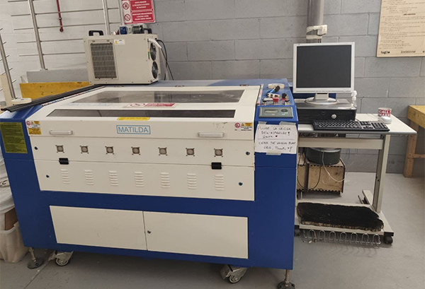   

Laser works focusing high energy in a little spot, burning out o vaporizing the material, and then blowing it out with compressed air, leaving an high quality edge.  
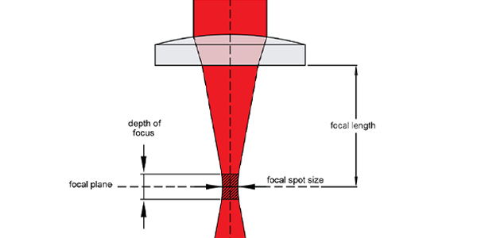 
<!-- inserire foto del cono laser, slide marco -->

| Fablab Laser Cutter Specs           | Values                                   |   
|:-----------------------------------|:-----------------------------------------|   
| Power                           	 | 130 W                                    |   
| Max speed of cut    			     | 200 mm/sec                               |   
| Focal spot dimension		      | 0,2 mm                                   |   
| Graphical resolution               | 0,0254 mm                                |   
| Max material thickness    | 10 mm                                    |      
| Cutting area max dimension   | 1200x900 mm                              |         

For more information regarding our machine please take a look at the [manufacter website](https://www.ricami.piemonte.it/-/plotter-laser-co2-1300x900mm-wl1390)

### Available materials
According to the laser type it is possibile to cut or engrave different materials.
At Fablab Torino we have a CO2 laser, and here it is the full list of [workable materials](https://www.worklinestore.com/pagina/elenco-materiali).   

| MATERIAL              |ENGRAVE    	      | CUT             |   
|------------------------|--------------------|--------------------|   
| Wood		             | __O__ | __O__ |   
| Acrylic - Plexiglas    | __O__ | __O__ |   
| Laminate 			     | __O__ | __O__ |   
| Fabric and textiles    | __O__ | __O__ |   
| Glass			         | __O__ | __X__ |   
| MDF                    | __O__ | __O__ |   
| Ceramic                | __O__ | __X__ |    
| Leather     		     | __O__ | __O__ |   
| Stone                  | __O__ | __X__ |   
| Paper and cardboad     | __O__ | __O__ |   
| Gum                    | __O__ | __O__ |   
| Cork	                 | __O__ | __O__ |   
| Alluminioum 		     | __O__ | __X__ |   
| Painted metal  	     | __O__ | __X__ |   
| Plastic                | __O__ | __O__ |   
| Fiberglass             | __O__ | __O__ |   

### PC with softwares
At Fablab you'll find, already linked to the Laser Cutter, a PC with the software needed to controll the machine:  __Lasercut 6.1__.   

### Processing file
The Laser Cutter operations are based on vector paths, therefore the file used must contain valid outlines, remember to check for double lines.
The __Lasercut 6.1__ software supports DXF format files (DXF 2000 / LT2000 is recommended).  
<!-- controllare che ai e jpg funzionino, bpm funziona? -->

### Accessories
The external objects required by this process are: iron rods to mantain the material flat, a rigid backdrop made of [alveolar metal] (https://www.cel.eu/it/prodotti/alveolari/alluminio) to support low-stiff materials. In some cases, a cutter may also be needed to help separate the pieces.   

## Cutting and engraving
Please follow those steps:  

### Power on
Turn on the power strip connected to the machine, then turn on the computer and the screen to the right of the Laser Cutter.
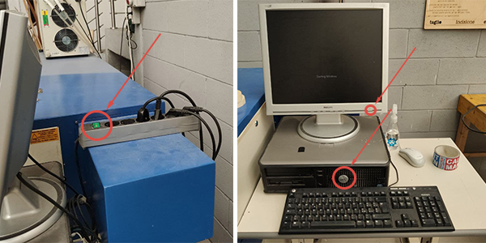

Turn on the __Chiller__ to the left of the machine from the rear switch.

__CAUTION!__ Before starting the machine make sure that the working surface is completely clear and free of obstacles.
Then turn the machine on by turning the key of the __main switch__, above the __control panel__ clockwise. Immediately after switching on, the nozzle will automatically position itself in the top right corner of the working surface, as shown in the photo.
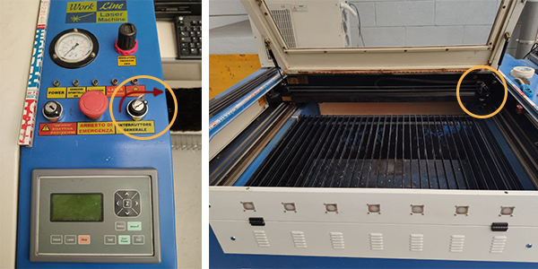

### Prepare the file
Insert the USB key containing the file and start __Lasercut 6.1__.
To open the vector file press _CTRL + I_ or follow the path _File_ > _Import_ > _select the file_.
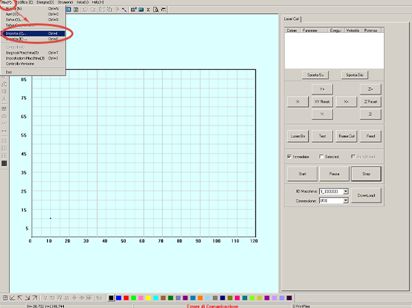

It is possible to move the object by dragging it from the blue _X_ placed in its center and rotate it using the arrow-like-icon on the left. It can also be scaled using the command in the left.    
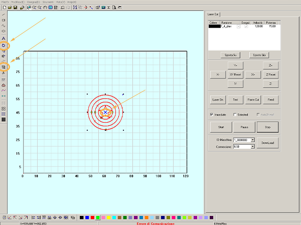

It is recommended to have a cutting file made up of continuous, non-fragmented lines. To automatically join neighboring segments select the lines and follow the path _Tools_ > _Join Lines_ > in the dialog box enter maximum distance between the lines to join> _Ok_.
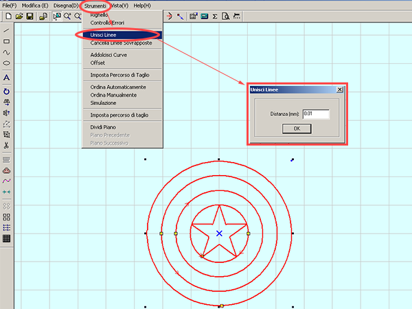 

Also, having double lines in the file could create problems or increasing the time when cutting. It is therefore recommended to check the double lines following the path _Tools_ > _Delete Overlapping Lines_, the program will select all the overlapping lines and just press the _CANC_ key to delete just the duplicates.
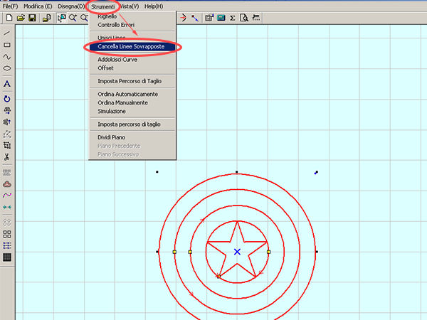

From the column on the right you can assign the object lines to different __cutting or engraving profiles__. By selecting the line to isolate [1] and assigning it a color from the bar at the bottom [2], the program inserts it in a separate and individually editable cutting profile [3].
With the _Move Up_ and _Move Down_ keys you can sort the colors according to the desired execution order.
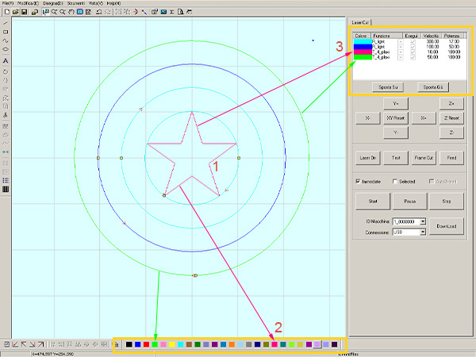

After assigned the various lines to the __cutting or engraving profiles__ you can set the characteristics according to the type of processing desired, by double clicking on the colors of the profiles. In the images below, the items to be modified for the __cutting and raster workings__ are highlighted in yellow.
__Attention!__ do not modify other parameters!
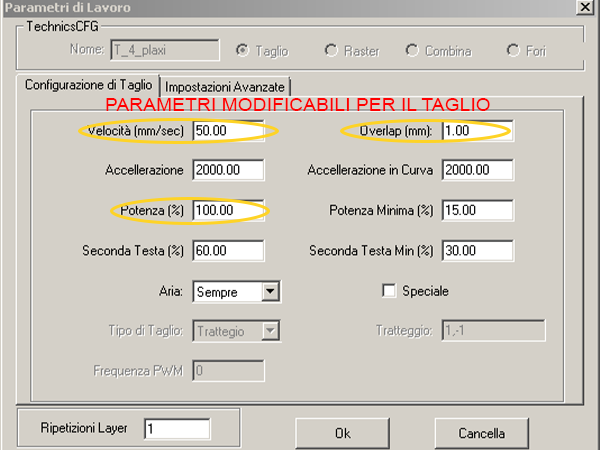
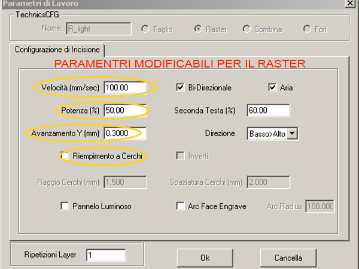

Always check where the  __cut origin point__ is, marked with a blue dot. You can change its position by pressing the top command and choosing the desired position from the dialog box, then press _Ok_ to confirm.
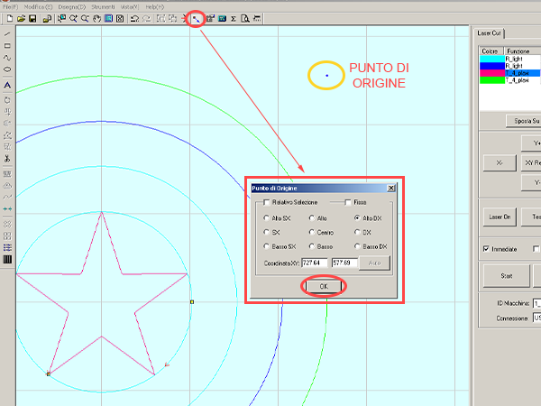

To send the file to the machine, follow the path _Download_ > _Download Current File_ > _choose a name_, then confirm the action.
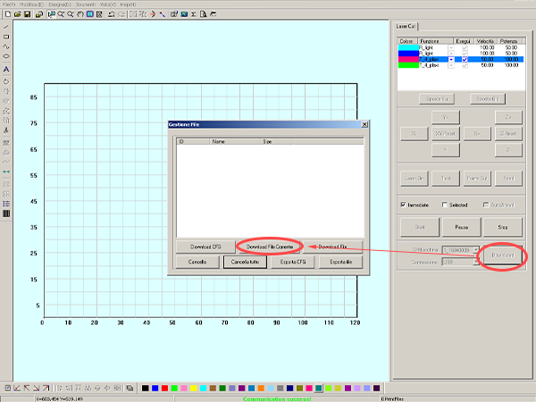

### Load the material
Open the cover of the machine to insert the material to be cut and/or engraved.
Make sure that the iron parts at the cutting plane of the machine are well arranged and in case of using a soft material (such as fabric or paper) add the __alveolar metal surface__.
Then block the material using the __iron rods__ (placed on the side of the machine) as weights. Finally, make sure that the material is stable by tapping lightly to hear if there are any embossed parts.
__WARNING!__ make sure that the __suction grill__ (in red) is clean!  
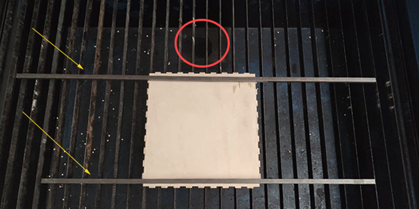

The conical shape of the laser also requires a z-axis adjustment.
Move the plane from the __control panel__ by pressing the `Z` key and then the `↑` and `↓` arrows, positioning it as high as possible without damaging the __laser output tube__ (gun). Then adjust the distance between the material and the tip of the gun using the wooden block (usually placed near the control panel). The suitable size is when the block is free to pass between the two but slightly touching them.
Finally press the `Z` key to exit the selection. 
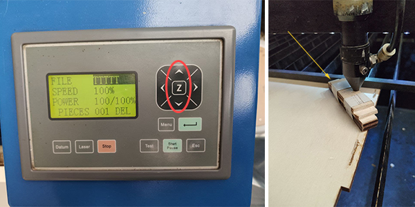

### Cut
Before proceeding with the cut it is good practice to do some tests. Press the `Esc` key to exit the selection, then use the `↑`,`↓`,`←` and `→` keys to position the head containing the laser on the material. Then press the `Test` key and see if the area described by the head fits completely into the material.
For further confirmation, the exact position of the laser starting point can be checked. With the __cover__ closed and the __head__ in the desired position, briefly press the `Laser` button to emit a beam and mark the starting point.
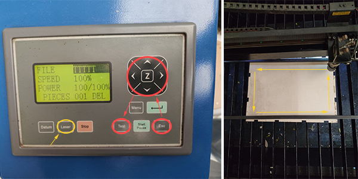

Always remember to turn on the __air extractor__ from the switch located behind the computer (in the photo).
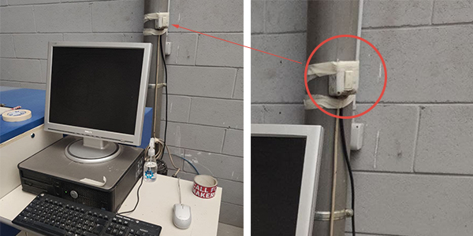

The machine can then be started by pressing the `Start / Pause` button on the __control panel__. While the Laser Cutter is performing the cut, it is necessary to check that the compressed air pressure is at least at 2, if necessary modify it by acting on the __valve__ indicated in the photo.
! [photo keypad] (img / laser-cutter-starting-machine.jpg)

When you finish cutting and engraving, press `Datum` on the __control panel__ to send the print head to the top right corner.
You can now take the material from the machine removing the excess pieces. 
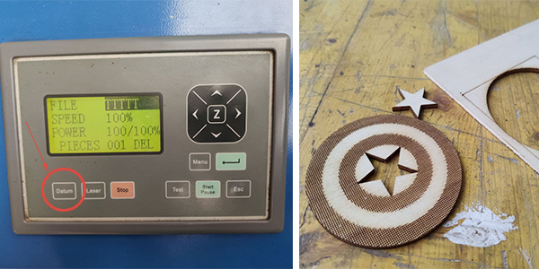

### Shutdown
At the end of the process the __air extractor__ can be switched off, and if the machine is no longer used, the __Chiller__ and the Laser Cutter must also be switched off by turning the __key__ in the front panel.
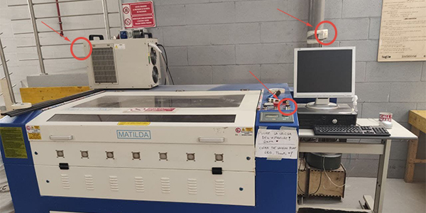

Turn off the Computer, the monitor and finally also the power strip positioned behind it.

## FAQ
__Why can't I cut PVC?__
PVC is not suitable for laser engraving or cutting due to specific substances it contains and the formation of hydrochloric acid and poisonous gases. 