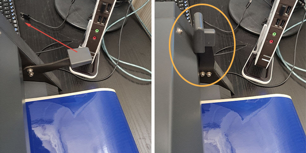

# Vinyl Cutter

The [Vinyl Cutter](https://en.wikipedia.org/wiki/Vinyl_cutter) is a CNC machine used for cutting self-adhesive plastic sheets (called vinyl) and other sheet materials with a maximum thickness of 0,5 mm.

## Index of topics:
- [Applications](#applications)
- [Tools, materials and files](#tools-materials-and-files)
- [Cutting process](#cutting-process)
- [Post-processing](#post-processing)
- [Inkscape](#inkscape)
- [FAQ](#faq)

## Applications
With the vinyl cutter it is possible to produce banners, pre-spaced label, vehicle graphics, signs, window decals, backlit, stencils and thermo-adhesives for t-shirts. It is also possible to transform the machine into a pen drawing plotter, thanks to special adapters. 

Most common materials are [vinyl](http://www.tosingraf.com/vinili-adesivi-da-stampa-e-taglio.html), [polyester](https://www.cplfabbrika.com/transfer/transfer-laser/poliestere-adesivo-stampabile.html) e [sandblast](https://www.fcsrl.com/categoria-prodotto/vinile-per-sabbiatura/), and thicker materials link [flex PVC](https://www.sinovinyl.com/product/color-pvc-graphic-cutting-vinyl-roll-film/), [flocked](https://tuttotransfer.it/termoadesivi-flex-e-flock-/termoadesivi-flock-floccato-velluto-scamosciato/) and [reflective vinyl](https://stampacontinua.it/index.php?route=product/category&path=1437_1441).   

## Tools, materials and files
Before starting, check this list:
- Vinyl Cutter
- Sheet or roll of vinyl
- PC with the necessary software installed
- File to be cut
- Accessories

### Vinyl Cutter Roland CAMM-1 SERVO GX-24

  
  

| Technical features | Values |
|: ----------------------------------- |: ----------- ------------------------------ |
| Cutting speed | From 10 to 500 mm / sec. (all directions) |
| Blade pressure | From 30 to 250 gf |
| Software Resolution | 0.025 mm / pitch |
| Maximum material thickness | 0.5 mm |
| Width of the material to be loaded | From 50 to 700 mm |
| Maximum size of cutting area | Width: 584 mm Length: 25 m |
| Repetition accuracy | ± 0.1 mm or less                  |     

<!-- inserire grandezza minima area di taglio? -->

For more informations refers to the [datasheet](src/scheda-tecnica.pdf) and to the [user manual](src/users-manual-en.pdf)

### Vinyl sheet
Vynil sheet is an extremely versatile support, available in many colors and suitable for printing, deriving from the processing of PVC and therefore flexible and resistant.
A self-adhesive vinyl sheet is always coupled to a protective silicone paper sheet, which prevents the glue from coming into contact with external surfaces or objects.
After cutting, a third layer called __Transfer__ is applied which holds the individual components of the sticker graphics together once the backing paper is removed. 

### PC with the necessary software installed
At Fablab you have the possibility to use the computer connected to the Vinyl Cutter, in which the necessary drivers and software are already installed.
The machine is compatible with computers with operating systems later than Windows 98 SE, equipped with the __Roland CutStudio__ software. 

### File to cut
The cutting plotter cut the trace of the desired graphic following the contours and lines with the blade. For this reason the file used must contain a defined outline and free from double lines and fills.
__Roland CutStudio__ software supports BMP, JPG, STX, AI and EPS files.
Optionally, for greater compatibility of formats you can use the __Inkscape__ software which supports SVG, STX AI, DXF, CDR, PDF, BMP, JPG, PNG, TIFF and many others. 

### Accessories
During processing, external objects must also be used: scissors or a cutter to separate the carved surface from the rest of the material; for the post-processing, an object with at least one flat side (such as a spatula or a credit card or similar) which allows an homogeneous application of the sticker without air bubbles; finally the [__Transfer__](https://www.necchishop.com/prodotto/pellicola-per-il-trasferimento/) is used to facilitate the positioning of the adhesive on the surface. 

## Cutting process
To cut the vinyl sheets follow the steps shown below.

### Power on

Turn on your computer and display and make sure the USB cable is connected to the vinylcut.

  

Turn on the machine using the `POWER` button.

### Load the material

<!-- sostituire con immagini da manuale -->

Lower the __loading lever__ on the rear left.

   

Insert the material at the back by sliding it through the slot of the machine and, if necessary, place it on the __roll holder__. Position the material so that it is parallel to the guidelines (__guide lines__) at the base of the machine.

Move the two pinch rollers (__pinch roller__) into the marked white spaces by sliding them from the rear of the machine.

   

Raise the loading lever (__loading lever__).

  

The display of the control panel (__operation panel__) will show `CARICO FOGLIO` (_LOAD SHEET_) followed immediately by `CARICA MEDIA` (_LOAD MEDIA_). Choose with the `↑` or `↓` keys the type of media used, among `ROTOLO`(_ROLL_),`FOGLIO`(_SHEET_) or `BORDO`(_EDGE_). Press `ENTER` to confirm.

### Prepare the file

Insert the USB key containing the file. Start __Cutstudio__, to open the cutting click on _import_ > select the file.

The __Cutstudio__ software has a fairly limited number of compatible files, to have more choice you can use the __Inkscape__ software first (see the [dedicated section](#inkscape)). With this program it is also possible to draw and modify vector graphics that cannot be created only with __Cutstudio__.

From __Cutstudio__ it is also possible to obtain the cutting outline from a file in PNG format.
To do this, import the png file as described in the previous section, then press the _right mouse button_ on the PNG and follow the path _Image profile ..._ > _Extract contour lines_ > _OK_.

The Vinyl Cutter automatically measures the size of the useful cutting surface during [material loading](#loading-material). Record these measurements on the worksheet following the path _cut_ > _modify_ > _properties_ > _get from machine_. Then confirm by clicking on _ok_ in the first two windows, but making sure to select _cancel_ in the last (as shown in yellow in the photo).

  
  
Use the _move_ command to position the contours at the cut origin.
Reduce or increase the size of the outline by using the arrows in the corners of the file (press _SHIFT_ to keep the aspect ratio) or by changing the values in the right column (check the box _Keep Aspect_ to maintain the aspect ratio).

### Cutting parameters

Depending on the material, change the blade force from the control panel (__operation panel__) by pressing the `FORCE` button. Press `←` or `→` on the keypad to unlock the selection, then modify the force grams with `↑` and `↓` and finally press `ENTER` to confirm the selection.

   

The __display__ should now indicate the blade pressure (expressed in gf), but also the cutting speed and the Offset distance. This last parameter depends on the blade mounted and it is important to always make sure that the indicated offset coincides with that of the blade in use.

 

<!-- qui in futuro si può inserire foto dell'adesivo che riporta le caratteristiche della lama, o simile -->

<!-- inserire immagine test da manuale -->

Before proceeding with the cut it is good practice to do some tests. Using the `↑`, `↓`, `←` and `→` keys, position the __cutting carriage__ in an unused space, then press the `TEST` key for at least one second.
Test the cut by peeling the circle, but without removing the square inside.

### Cut
If a roll is used, it may be useful to reset the cut origin point: move the __cutting carriage__ to the desired origin point with the `←`, `→`, `↑` and `↓` keys. In the desired position, press and hold `ORIGIN` on the __operation panel__.

Start the cut from Cutstudio, following the path _cut_ > _ok_.

To vary the blade force during cutting, you can adjust it from the `PEN FORCE` slider.

 

After cutting, bring the material forward with the `↓` key on the  __operation panel__ and if you are using a roll, cut the processed rectangle.

   

At the end of processing, extract the roll or sheet, it is the reverse step to the [loading phase](#load-the-material) and it consists in lowering the __loading lever__ and extracting the material.

### Shutdown
At the end of use, turn off the Vinylcut by pressing and holding the `POWER` button.

   

Eject the USB from the computer and proceed with shutting down the computer. Lastly, turn off the computer screen.

## Post-processing

Begin post-processing by removing excess adhesive both on the outside and inside of the cut contour.

  

In order to transfer the adhesive from the backing paper to the application surface, the __Transfer__ must be used. Therefore, cut a piece of __Transfer__ large enough to cover the whole sticker.

   

Apply the __Transfer__ making sure to have a complete and homogeneous adhesion to the sticker. For a further test, you can slightly lift the __Transfer__ and check that the sticker remains attached to it, as shown in the photo.

 

Now you can apply the sticker on the desired surface!
Separate the transfer and the adhesive from the protective paper, place it on the chosen surface and glue it evenly.

## Inkscape

To import the file on __inkscape__ click on _File_ > _ Import_> select the file.

 

Once the file is opened, the vector path is completely editable on __Inkscape__, and it is also possible to check the lines by changing the display hold via  _View_ > _View mode_ > _Skeleton_.

Finally, thanks to the [plug-in](https://github.com/mgmax/inkscape-roland-cutstudio), it is possible to go directly to the __Cutstudio__ software. To do this, follow the path _Extensions_ > _Roland CutStudio_ > _Open in CutStudio_.

## FAQ
<!-- quali sono i problemi più frequenti? -->
__The computer and the cutting plotter are turned on but are not communicating with each other, why?__
Check that the cables are all inserted correctly, as shown in the [power on step](#power-on).