# Laser Cutter

<!-- inserire indice -->

Il [Laser Cutter](https://en.wikipedia.org/wiki/Laser_cutting) è un macchinario a controllo numerico che utilizza un laser per tagliare i materiali. Questa tecnologia funziona dirigendo e concentrando un laser ad alta potenza attraverso l'ottica. Il raggio laser focalizzato è diretto verso il materiale, tagliandolo o incidendolo in base alla potenza impiegata.

## Applicazioni
Il taglio laser viene applicato a numerosi settori dell’industria poichè permette di ottenere lavorazioni molto precise. Tra i settori coinvolti ci sono l'edilizia, l'arredo, la costruzione di prototipi, l’automotive, il settore ferroviario, l’ingegneria strutturale e quella aerospaziale, la costruzione di imbarcazioni, veicoli commerciali e macchine per l’agricoltura.   

Tutti i materiali di uso più comune nella lavorazione industriale possono essere lavorati con il laser in modo sicuro e con risultati di alta qualità. Tra questi ci sono [metalli](https://www.materiali-per-incisione.it/materiali-laser/metalli.html), [materiali plastici](https://www.materiali-per-incisione.it/materiali-laser/acrilico.html), [stoffe e pelli](https://www.materiali-per-incisione.it/materiali-laser/laserleather.html), [legno](https://www.materiali-per-incisione.it/materiali-laser/legno-per-incisione.html), [carta](https://www.materiali-per-incisione.it/materiali-laser/laserpaper.html), vetro e ceramiche.   

## Strumenti, materiali e file
Prima di iniziare assicurati di avere tutto il necessario:  
- Laser Cutter  
- materiale da tagliare  
- PC con installati i software necessari  
- File da tagliare  
- Accessori (barre per fissare il materiale, fondale rigido)  

### Laser Cutter CO2 WL1290
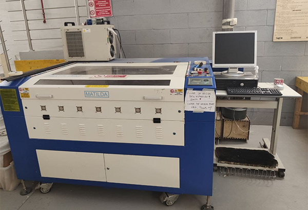   

Il laser taglia concentrando un'alta energia in un piccolo spot, sciogliendo, bruciando o vaporizzando il materiale che viene poi soffiato via da un getto di aria compressa, lasciando un bordo di taglio di ottima qualità.   
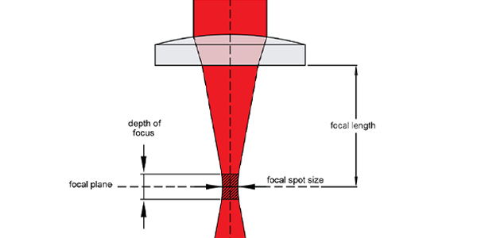 
<!-- inserire foto del cono laser, slide marco -->

| Caratteristiche tecniche           | Valori                                   |   
|:-----------------------------------|:-----------------------------------------|   
| Potenza                            | 130 W                                    |   
| Velocità massima di taglio         | 200 mm/sec                               |   
| Dimensione dello spot focale       | 0,2 mm                                   |   
| Risoluzione grafica                | 0,0254 mm                                |   
| Spessore massimo del materiale     | 10 mm                                    |      
| Grandezza massima area di taglio   | 1200x900 mm                              |         

Per ulteriori informazioni consultare la scheda tecnica sul [sito del rivenditore](https://www.ricami.piemonte.it/-/plotter-laser-co2-1300x900mm-wl1390)

### Materiali lavorabili
In base alla tipologia di Laser Cutter è possibile tagliare e incidere diverse tipologie di materiali.   
Il Fablab dispone di un macchinario a CO2, di seguito una lista completa dei [materiali lavorabili](https://www.worklinestore.com/pagina/elenco-materiali).   

| MATERIALE              |INCISIONE    	      | TAGLIO             |   
|------------------------|--------------------|--------------------|   
| Legno		             | __O__ | __O__ |   
| Acrilico - Plexiglas   | __O__ | __O__ |   
| Laminati Bicolore	     | __O__ | __O__ |   
| Tessuti e Stoffe       | __O__ | __O__ |   
| Vetro e Cristallo      | __O__ | __X__ |   
| MDF                    | __O__ | __O__ |   
| Ceramica               | __O__ | __X__ |    
| Pelle e Cuoio          | __O__ | __O__ |   
| Marmo e Pietra         | __O__ | __X__ |   
| Carta e Cartone	     | __O__ | __O__ |   
| Gomma                  | __O__ | __O__ |   
| Sughero                | __O__ | __O__ |   
| Alluminio Anodizzato   | __O__ | __X__ |   
| Metallo Verniciato     | __O__ | __X__ |   
| Plastica               | __O__ | __O__ |   
| Vetroresina            | __O__ | __O__ |   

### PC con installato i software necessari
Al Fablab hai la possibilità di utilizzare il computer collegato alla Laser Cutter, nel quale sono già presenti i drivers e i software necessari.   
Il macchinario è compatibile con computer con sistemi operativi successivi a Windows XP, equipaggiati con il software __Lasercut 6.1__.   

### File da tagliare
Le lavorazioni della Laser Cutter si basano su tracciati vettoriali, perciò il file utilizzato deve contenere contorni definiti e privi di doppie linee e riempimenti.   
Il software __Lasercut 6.1__ supporta file di formato DXF (si consiglia il DXF 2000/LT2000).   
<!-- controllare che ai e jpg funzionino, bpm funziona? -->

### Accessori
Gli oggetti esterni richiesti da questa lavorazione sono: delle barre di ferro per evitare l'imbarcamento del pezzo da tagliare, un fondale rigido in [metallo alveolare](https://www.cel.eu/it/prodotti/alveolari/alluminio) per supportare i materiali poco rigidi. In alcuni casi potrebbe servire anche un taglierino (o Cutter) per aiutare la separazione dei pezzi.   

## Processo di taglio
Per tagliare con la Laser Cutter segui i passaggi illustrati di seguito.   

### Accensione
Accendere la ciabatta elettrica collegata alla macchina, quindi accendere anche il computer e lo schermo alla destra della Laser Cutter.   
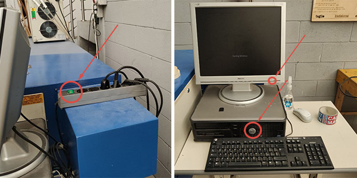

Accendere il refrigeratore (__Chiller__) a sinistra della macchina dallo switch posteriore.   
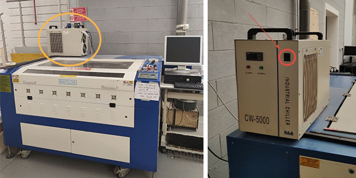

__ATTENZIONE!__ Prima di avviare la macchina assicurarsi che il piano di lavoro sia completamente sgombro e privo di ostacoli.    
Accendere quindi la macchina girando in senso orario la chiave dell'__interruttore generale__, sopra il __pannello di controllo__. Appena dopo l'accensione l'ugello si posizionerà automaticamente nell'angolo in alto a destra del piano, come mostrato in foto.   
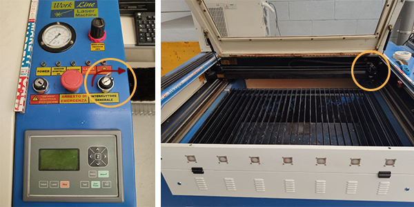

### Preparare il file   
Inserire la chiavetta USB contenente il file e avviare __Lasercut 6.1__.   
Per aprire il file vettoriale premere _CTRL+I_ oppure seguire il percorso _File_>_Importa_>selezionare il file.   
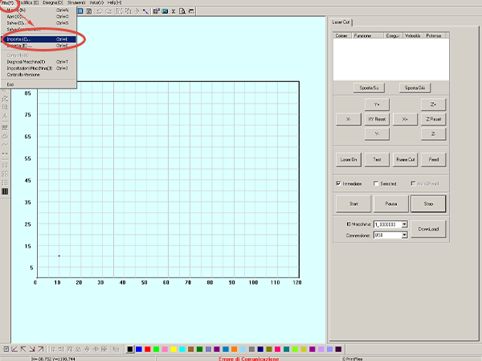

È possibile muovere il soggetto trascinandolo dalla _X_ blu posta al suo centro e ruotarlo utilizzando l'icona a sinistra raffigurante una freccia. Si può inoltre scalarlo utilizzando il comando nella colonna a sinistra raffigurante un rettangolo quotato.   
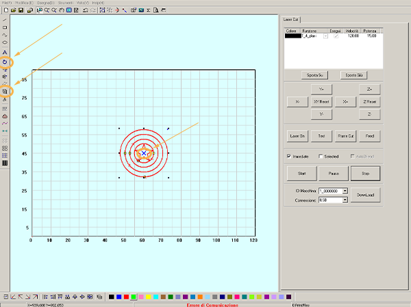

Dalla colonna a destra è possibile dividere le linee dell'oggetto in base a diversi __profili di taglio o incisione__. Selezionando la linea da isolare [1] e assegnandole un colore dalla barra in basso [2], il programma la inserisce in un profilo di taglio separato e modificabile in modo individuale [3].   
Con i tasti _Sposta Su_ e _Sposta Giù_ si possono ordinare i colori in base all'ordine di esecuzione desiderato.  
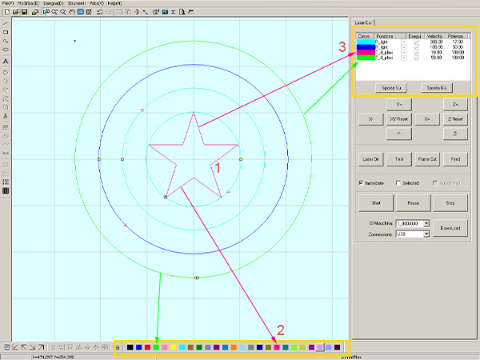

Assegnate le varie linee ai __profili di taglio o incisione__, facendo doppio click sui colori dei profili si possono impostare le caratteristiche in base al tipo di lavorazione desiderata. Nelle immagini di seguito, sono evidenziate in giallo le voci da modificare per le __lavorazioni di taglio e raster__.   
__Attenzione!__  non modificare gli altri parametri!
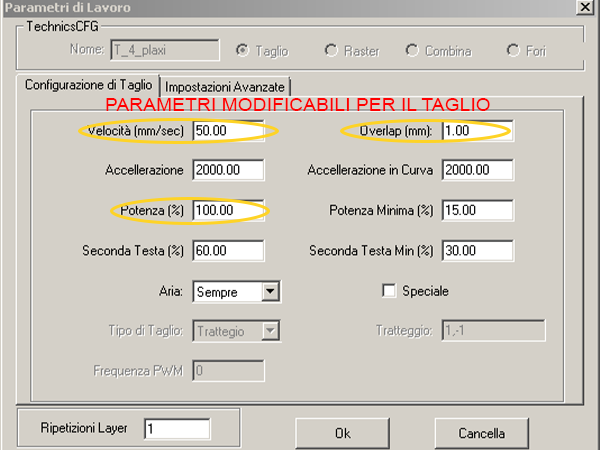
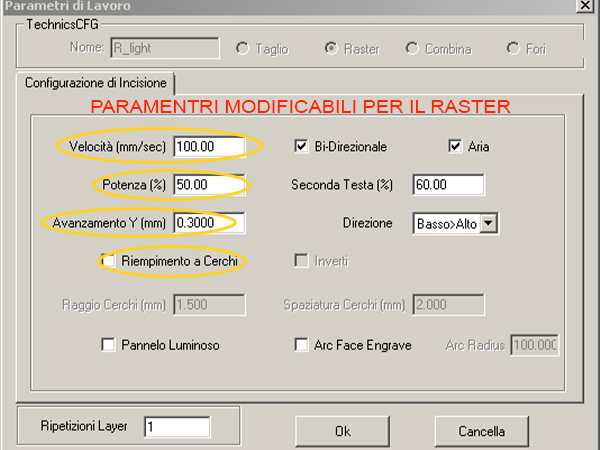

Controllare sempre dove è il __punto di origine del taglio__, segnato con un pallino blu. È possibile modificarne la posizione premendo il comando in alto e scegliendo la posizione desiderata dalla finestra di dialogo, premere infine _Ok_ per confermare.
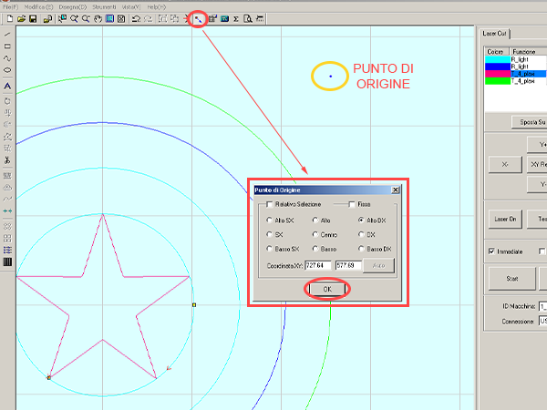

Per inviare il file al macchinario si deve seguire il percorso _Download_>_Download File Corrente_>scegliere un nome, infine confermare l'azione.   
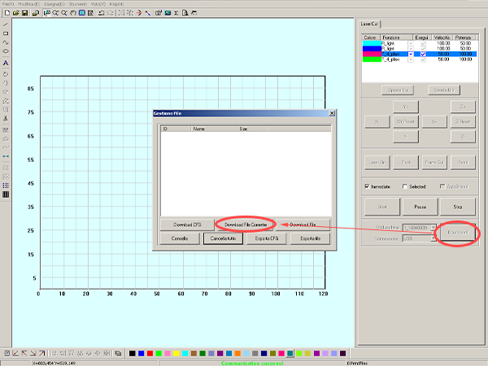

### Caricare il materiale 
Aprire quindi il __coperchio__ del macchinario per inserire il materiale da tagliare e incidere.     
Assicurarsi che le __doghe__ di ferro del macchinario siano ben disposte e nel caso di un materiale morbido (come il tessuto o la carta) aggiungere il piano in __metallo alveolare__.   
Bloccare quindi il materiale utilizzando le __sbarre di ferro__ (poste a lato della macchina) come pesi. Assicurarsi infine che il materiale sia stabile, tamburellando lievemente per sentire se ci sono parti imbarcate.   
__ATTENZIONE!__ assicurarsi che la __griglia dell'aspiratore__ (in rosso) sia pulita!   
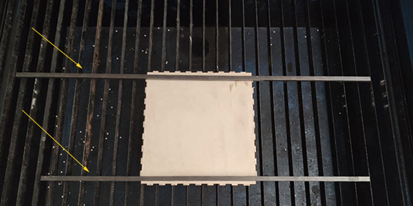

La forma conica del laser richiede anche una regolazione dell'asse z.   
Muovere il piano dal __pannello di controllo__ premendo il tasto `Z` e poi le freccie `↑` e `↓`, posizionandolo il più in alto possibile senza danneggiare il __cannone del laser__. Quindi regolare la distanza tra il materiale e la punta del cannone utilizzando il blocchetto di legno (in genere appoggiato vicino al pannello di controllo). La misura adatta si ha quando il blocchetto è libero di passare tra i due ma sfiorandoli.   
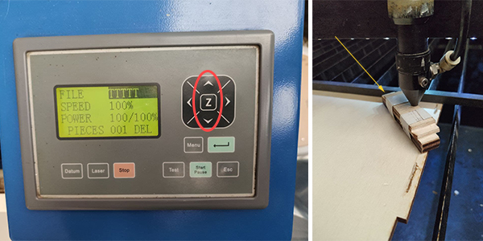

### Tagliare
Prima di procedere al taglio è buona pratica fare dei test. Premere il tasto `Esc` per uscire dalla selezione, poi tramite i tasti `↑`, `↓`, `←` e `→` posizionare la testina contenente il laser sul materiale. Quindi premere il tasto `Test` e osservare se l'area descritta dalla testina rientra completamente nel materiale.   
Per un'ulteriore conferma si può verificare l'esatta posizione del punto di partenza del laser. A __coperchio__ chiuso e __testina__ nella posizione desiderata, premere brevemente il tasto `Laser` per emettere un raggio e segnare il punto di partenza.   
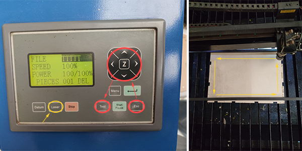

Ricordarsi sempre di accendere l'__aspiratore__ dallo switch posto dietro al computer (in foto).   
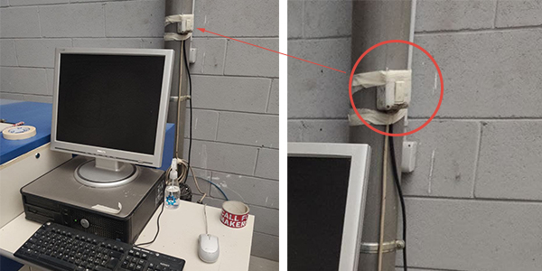

Si può quindi avviare il macchinario premendo il tasto `Start/Pause` sul __pannello di controllo__. Mentre la Laser Cutter esegue il taglio bisogna controllare che la pressione indicata sia a 2, se necessario modificarla agendo sulla __valvola__ indicata in foto.   
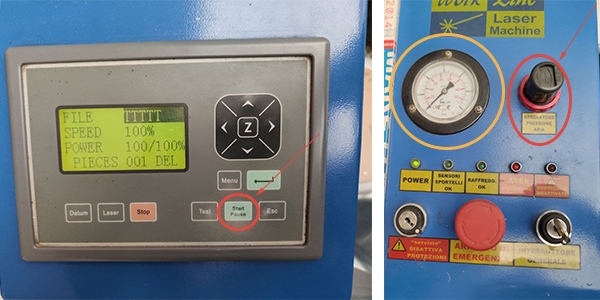

A taglio e incisione terminati premere `Datum` sul __pannello di controllo__ per inviare la testina nell'angolo in alto a destra.   
Si può quindi prelevare il materiale dal macchinario e separare e rimuovere i pezzi in eccesso.   
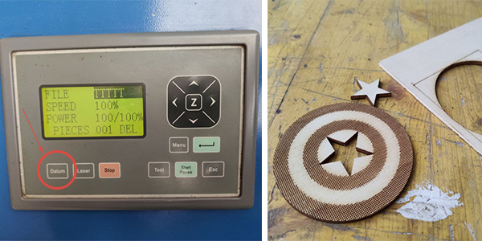

### Spegnimento 
Finito il processo si può spegnere l'__aspiratore__, se invece non si utilizza più il macchinario si deve spegnere anche il __Chiller__ e la Laser Cutter, girando la chiave di __avviamento__.   
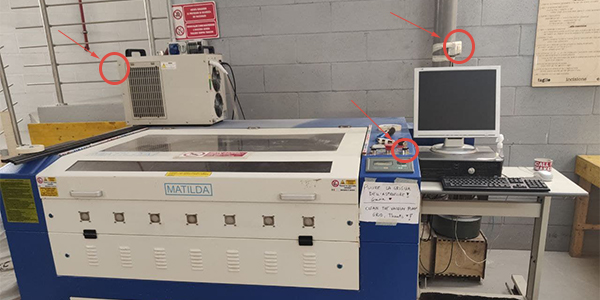

Spegnere infine anche il Computer, il monitor e infine anche la ciabatta elettrica posizionata dietro, visibile nella [fase di accensione](#accensione).   

## FAQ
__Perchè non posso tagliare il PVC?__   
Il PVC non è adatto per l'incisione o il taglio laser a causa di sostanze specifiche che contiene e la formazione di acido cloridrico e gas velenosi.