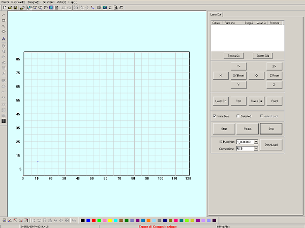

# Laser Cutter
Il [Laser Cutter](https://en.wikipedia.org/wiki/Laser_cutting) è un macchinario a controllo numerico che utilizza un laser per tagliare i materiali. Questa tecnologia funziona dirigendo e concentrando un laser ad alta potenza attraverso l'ottica. Il raggio laser focalizzato è diretto verso il materiale, tagliandolo o incidendolo in base alla potenza impiegata.

## Applicazioni
Il taglio laser viene applicato a numerosi settori dell’industria poichè permette di ottenere lavorazioni molto precise. Tra i settori coinvolti ci sono l'edilizia, l'arredo, la costruzione di prototipi, l’automotive, il settore ferroviario, l’ingegneria strutturale e quella aerospaziale, la costruzione di imbarcazioni, veicoli commerciali e macchine per l’agricoltura.

Tutti i materiali di uso più comune nella lavorazione industriale possono essere lavorati con il laser in modo sicuro e con risultati di alta qualità. Tra questi ci sono [metalli](https://www.materiali-per-incisione.it/materiali-laser/metalli.html), [materiali plastici](https://www.materiali-per-incisione.it/materiali-laser/acrilico.html), [stoffe e pelli](https://www.materiali-per-incisione.it/materiali-laser/laserleather.html), [legno](https://www.materiali-per-incisione.it/materiali-laser/legno-per-incisione.html), [carta](https://www.materiali-per-incisione.it/materiali-laser/laserpaper.html), vetro e ceramiche. 

## Strumenti, materiali e file
Prima di iniziare assicurati di avere tutto il necessario:
- Laser Cutter
- materiale da tagliare
- PC con installati i software necessari
- File da tagliare
- Accessori (barre per fissare il materiale, fondale rigido)

### Laser Cutter CO2 WL1290
 

Il laser taglia concentrando un'alta energia in un piccolo spot, sciogliendo, bruciando vaporizzando il materiale che viene poi soffiato via da un getto di aria compressa, lasciando un bordo di taglio di ottima qualità.
 
<!-- inserire foto del cono laser, slide marco -->

| Caratteristiche tecniche           | Valori                                   |   
|:-----------------------------------|:-----------------------------------------|   
| Potenza                            | 130 W                                    |
| Velocità massima di taglio         | 200 mm/sec                               |   
| Dimensione dello spot focale       | 0,2 mm                                   |   
| Risoluzione grafica                | 0,0254 mm                                |   
| Spessore massimo del materiale     | 10 mm                                    |      
| Grandezza massima area di taglio   | 1200x900 mm                              |   
| Grandezza minima area di taglio    |                                          |        

Per ulteriori informazioni consultare la scheda tecnica sul [sito del rivenditore](https://www.ricami.piemonte.it/-/plotter-laser-co2-1300x900mm-wl1390)

### Materiali lavorabili
In base alla tipologia di Laser Cutter è possibile tagliare e incidere diverse tipologie di materiali.   
Il Fablab dispone di un macchinario a CO2, di seguito una lista completa dei [materiali lavorabili](https://www.worklinestore.com/pagina/elenco-materiali).   

| MATERIALE              |INCISIONE    	      | TAGLIO             |   
|------------------------|--------------------|--------------------|   
| Legno		             | :heavy_check_mark: | :heavy_check_mark: |   
| Acrilico - Plexiglass  | :heavy_check_mark: | :heavy_check_mark: |   
| Laminati Bicolore	     | :heavy_check_mark: | :heavy_check_mark: |   
| Tessuti e Stoffe       | :heavy_check_mark: | :heavy_check_mark: |   
| Vetro e Cristallo      | :heavy_check_mark: | :x:                |   
| MDF                    | :heavy_check_mark: | :heavy_check_mark: |   
| Ceramica               | :heavy_check_mark: | :x:                |    
| Pelle e Cuoio          | :heavy_check_mark: | :heavy_check_mark: |   
| Marmo e Pietra         | :heavy_check_mark: | :x:                |   
| Carta e Cartone	     | :heavy_check_mark: | :heavy_check_mark: |   
| Gomma                  | :heavy_check_mark: | :heavy_check_mark: |   
| Sughero                | :heavy_check_mark: | :heavy_check_mark: |   
| Alluminio Anodizzato   | :heavy_check_mark: | :x:                |   
| Metallo Verniciato     | :heavy_check_mark: | :x:                |   
| Plastica               | :heavy_check_mark: | :heavy_check_mark: |   
| Vetroresina            | :heavy_check_mark: | :heavy_check_mark: |   

### PC con installato i software necessari
Al Fablab hai la possibilità di utilizzare il computer collegato alla Laser Cutter, nel quale sono già presenti i drivers e i software necessari.   
Il macchinario è compatibile con computer con sistemi operativi successivi a Windows XP, equipaggiati con il software __Lasercut 6.1__.  

### File da tagliare
Le lavorazioni della Laser Cutter si basano su tracciati vettoriali, perciò il file utilizzato deve contenere contorni definiti e privi di doppie linee e riempimenti.   
Il software __Lasercut 6.1__ supporta file di formato DXF, AI e JPG.
<!-- controllare che ai e jpg funzionino, bpm funziona? -->

### Accessori
Gli oggetti esterni richiesti da questa lavorazione sono: delle barre di ferro per evitare l'imbarcamento del pezzo da tagliare, un fondale rigido in [metallo alveolare](https://www.cel.eu/it/prodotti/alveolari/alluminio) per supportare i materiali poco rigidi. In alcuni casi potrebbe servire anche un taglierino (o Cutter) per aiutare la separazione dei pezzi.

## Processo di taglio

Per tagliare con la Laser Cutter segui i passaggi illustrati di seguito.

### Accensione
Accendere la ciabatta elettrica collegata alla macchina, quindi accendere anche il computer e lo schermo alla destra della Laser Cutter.   

Accendere il refrigeratore (__chiller__) a sinistra della macchina dallo switch posteriore.   

Prima di avviare la macchina assicurarsi che il piano di lavoro sia completamente sgombro e privo di ostacoli.    
Accendere quindi la macchina girando in senso orario la chiave dell'__interruttore geneale__, sopra il __pannello di controllo__. Appena dopo l'accensione l'ugello si posizionerà automaticamente nell'angolo in alto a destra del piano, come mostrato in foto.   

### Preparare il file   
Inserire la chiavetta USB contenente il file e avviare Lasercut 6.1.  

Per aprire il file vettoriale premere _CTRL+I_ oppure seguire il percorso _file_>_importa_>selezionare il file.  

È possibile muovere il soggetto trascinandolo dalla _X_ blu posta al suo centro e ruotarlo utilizzando l'icona a sinistra raffigurante una freccia. Si può inoltre scalarlo utilizzando il comando nella colonna a sinirstra raffigurante un rettangolo quotato.  

colori linee e decisione potenza  

<!-- per questa parte vedere se sul manuale c'è qualcosa di chiaro -->

Per inviare il file al macchinario si deve seguire il percorso _download_>_Download File Corrente_>scegliere un nome, infine confermare l'azione. 

### Caricare il materiale 
Aprire quindi il coperchio del macchinario per inserire il materiale da tagliare e incidere. Assicurarsi che le doghe di ferro del macchinario siano ben disposte e nel caso di un materiale morbido (come il tessuto o la carta) aggiungere il piano in metallo alveolare.
Assicurare quindi il materiale utilizzando le sbarre di ferro (poste a lato della macchina) come pesi. Assicurarsi infine che il materiale sia stabile, tamburellando lievemente per sentire se ci sono parti imbarcate.   

La forma conica del laser richiede anche una regolazione dell'asse z.
Muovere il piano dal pannello di controllo premendo il tasto _Z_ e poi le freccie _su_ e _giu_, posizionandolo il più in alto possibile senza danneggiare il cannone del laser. Quindi regolare la distanza tra il materiale e la punta del cannone utilizzando il blocchetto di legno (in genere appoggiato vicino al pannello di controllo) . La misura adatta si ha quando il blocchetto è libero di passare tra i due ma sfiorandoli.  

<!-- mancano le foto per questa parte -->

### Tagliare
Posizionare testina per test   
test   
test punto di inizio   

<!-- per questa parte vedere se sul manuale c'è qualcosa di chiaro -->

accendere aspiratore   

avvio taglio e controllo pressione   

staccare i pezzi e togliere il materiale
testina in autohome

### Spegnimento 
spegnere aspiratore   
spegnere macchinario   
spegnere chiller   

spegnere pc   
spegnere schermo   
spegnere ciabatta   

## FAQ
__Perchè non posso tagliare il PVC?__