# Vinyl Cutter

La [Vinyl Cutter](https://en.wikipedia.org/wiki/Vinyl_cutter) è un macchinario a controllo numerico utilizzato per il taglio di fogli di plastica autoadesiva (chiamata vinile) e materiali in fogli con uno spessore massimo di 0,5 mm. 

## Indice degli argomenti:
- [Applicazioni](#applicazioni)
- [Strumenti, materiali e file](#strumenti-materiali-e-file)
- [Processo di taglio](#processo-di-taglio)
- [Post-processing](#post-processing)
- [Inkscape](#inkscape)
- [FAQ](#faq)

## Applicazioni
Tramite vinylcut si possono produrre banner, striscioni, prespaziati, grafica veicolare, insegne, segnaletica, vetrofanie, retroilluminati, stencil e termo-adesivi per magliette. È inoltre possibile trasformare la macchina in un plotter da disegno a penna, grazie ad appositi adattatori. 

I materiali più utilizzati sono [vinile](http://www.tosingraf.com/vinili-adesivi-da-stampa-e-taglio.html), [poliestere](https://www.cplfabbrika.com/transfer/transfer-laser/poliestere-adesivo-stampabile.html) e [sandblast](https://www.fcsrl.com/categoria-prodotto/vinile-per-sabbiatura/), ma gestisce tranquillamente anche materiali più pesanti come [PVC flessibili](https://www.sinovinyl.com/product/color-pvc-graphic-cutting-vinyl-roll-film/), [floccati](https://tuttotransfer.it/termoadesivi-flex-e-flock-/termoadesivi-flock-floccato-velluto-scamosciato/) e [vinili riflettenti](https://stampacontinua.it/index.php?route=product/category&path=1437_1441).   

## Strumenti, materiali e file
Prima di iniziare assicurati di avere tutto il necessario:
- Vinyl Cutter
- Foglio o rotolo di vinile
- PC con installati i software necessari 
- File da tagliare
- Accessori (forbici, taglierino, spatola, Transfer)

### Vinyl Cutter Roland CAMM-1 SERVO GX-24

  
  

| Caratteristiche tecniche           | Valori                                   |   
|:-----------------------------------|:-----------------------------------------|   
| Velocità di taglio                 | Da 10 a 500 mm/sec. (tutte le direzioni) |   
| Pressione della lama               | Da 30 a 250 gf                           |   
| Risoluzione del Software           | 0,025 mm/passo                           |   
| Spessore massimo del materiale     | 0,5 mm                                   |   
| Larghezza del materiale caricabile | Da 50 a 700 mm                           |   
| Grandezza massima area di taglio   | Larghezza: 584 mm Lunghezza: 25 m        |   
| Precisione di ripetizione          | ±0.1 mm o inferiore                      |     

<!-- inserire grandezza minima area di taglio? -->

Per ulteriori informazioni consultare la [scheda tecnica](src/scheda-tecnica.pdf) e il [manuale dell'utente](src/users-manual-en.pdf)

### Foglio di vinile
Il vinile in fogli è un supporto estremamente versatile, disponibile in molti colori e adatto alla stampa, derivante dalla lavorazione del PVC e perciò flessibile e resistente.   
Un foglio di vinile autoadesivo è sempre accoppiato ad un foglio di carta siliconata protettiva, la quale evita che la colla entri in contatto con superfici o oggetti esterni.   
Dopo il taglio viene applicato un terzo strato chiamato __Transfer__ che tiene insieme i singoli componenti della grafica dell'adesivo, una volta rimossa la carta protettiva.

### PC con installati i software necessari
Al Fablab hai la possibilità di utilizzare il computer collegato alla Vinyl Cutter, nel quale sono già presenti i drivers e i software necessari.   
Il macchinario è compatibile con computer con sistemi operativi successivi a Windows 98 SE, equipaggiati con il software __Roland CutStudio__. 

### File da tagliare
Il plotter da taglio intaglia la traccia della grafica desiderata seguendo i contoni e le linee con la lama. Per questo motivo il file utilizzato deve contenere un contorno definito e privo di doppie linee e riempimenti.   
Il software __Roland CutStudio__ supporta file di formato BMP, JPG, STX, AI ed EPS.   
Opzionale, per avere una maggiore compatibilità di formati si può utilizzare il software __Inkscape__ che supporta file SVG, STX AI, DXF, CDR, PDF, BMP, JPG, PNG, TIFF e moltri altri.

### Accessori
Durante la lavorazione si dovrà fare uso anche di oggetti esterni: le forbici o il taglierino per separare la superficie intagliata dal resto del materiale; per la fase di post-processing può essere utile un oggetto con almeno un lato piatto (come una spatola o una carta di credito e simili) che permetta una applicazione dello sticker omogenea e senza bolle d'aria; infine il [__Transfer__ o pellicola di trasferimento](https://www.necchishop.com/prodotto/pellicola-per-il-trasferimento/) viene utilizzato per facilitare il posizionamento dell'adesivo sulla superficie.

## Processo di taglio

Per tagliare i fogli in vinile segui i passaggi illustrati di seguito.

### Accensione

Accendere computer e schermo e assicurarsi che il cavo USB sia collegato alla vinycut.   
  

Accendere il macchinario tramite il tasto `POWER` .   

### Caricare il materiale 

<!-- sostituire con immagini da manuale -->

Abbassare la leva di caricamento (__loading lever__) sul retro a sinistra.   
   

Inserire posteriormente  il materiale facendolo scorrere attraverso la fessura della macchina e, se necessario, appoggiarlo al __portarotolo__. Posizionare il materiale in modo che sia parallelo alle linee guida (__guide lines__) in rilievo alla base del macchinario.   

Spostare i due rulli di fissaggio (__pinch roller__) negli spazi bianchi segnati, facendoli scorrere dalla parte posteriore della macchina.   
   

Alzare la leva di caricamento (__loading lever__).   
   

Sul display del pannello di controllo (__operation panel__) compare la scritta `CARICO FOGLIO` seguita subito da `CARICA MEDIA`. Scegliere con i tasti `↑` o `↓` il tipo di supporto utilizzato, tra `ROTOLO`, `FOGLIO` o `BORDO`. Premere `ENTER` per confermare.  

### Preparare il file

Inserire la chiavetta USB contenente il file. Avviare __Cutstudio__, per aprire il file di taglio seguire il percorso _importa_>selezionare il file.   

Il software __Cutstudio__ ha un numero abbastanza limitato di file compatibili, per avere una maggiore scelta si può utilizzare prima il software __Inkscape__ (vedere la [sezione dedicata](#inkscape)). Con questo programma è inoltre possibile disegnare e modificare grafiche vettoriali non realizzabili solo con __Cutstudio__.   

Da __Cutstudio__ è anche possibile ricavare il contorno di taglio da un file in formato PNG.   
Per farlo, iportare il file png come descritto nella sezione precedente, quindi premere con il _tasto destro del mouse_ sul PNG e seguire il percorso _Profilo dell'immagine..._>_Estrarre linee di contorno_>_OK_.
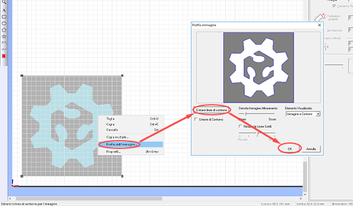

La Vinyl Cutter durante il [caricamento del materiale](#caricare-il-materiale) misura in automatico la dimensione della superficie utile di taglio. Riportare queste misure sul foglio di lavoro seguendo il percorso _tagliare_>_modifica_>_proprietà_>_get from machine_. Confermare quindi cliccando su _ok_ nelle prime due finestre, ma facendo attenzione a selezionare _annulla_ nell'ultima (come mostrato in giallo in foto).   
   
  
Utilizzare il comando _spostare_ per posizionare i contorni in corrispondenza dell'origine di taglio.   
Ridurre o aumentare le dimensioni del contorno agendo sulle frecce agli angoli del file (premere _SHIFT_ per mantenere le proporzioni) o modificando i valori nella colonna destra (spuntare la casella _Conserva Aspetto_ per mantenere le proporzioni).   

### Parametri di taglio

In base al materiale modificare la pressione della lama dal pannello di controllo (__operation panel__) premendo sul tasto `FORCE`. Premere `←` o `→` sulla pulsantiera per sbloccare la selezione, quindi modificare i grammi forza con `↑` e `↓` e premere infine `ENTER` per confermare la selezione.   
   

Il __display__ dovrebbe ora indicare la pressione della lama (espressa in gf), ma anche la velocità di taglio e la distanza di Offset. Quest'ultima dipende dalla lama montata ed è importante assicurarsi sempre che l'Offset indicato coincida con quello della lama in utilizzo.   
 

<!-- qui in futuro si può inserire foto dell'adesivo che riporta le caratteristiche della lama, o simile -->

<!-- inserire immagine test da manuale -->

Prima di procedere al taglio è buona pratica fare dei test. Tramite i tasti `↑`, `↓`, `←` e `→` posizionare il carrello di taglio (__cutting carriage__) in uno spazio inutilizzato, quindi premere il tasto `TEST` per almeno un secondo.   
Testare il taglio spellicolando il cerchio, ma senza rimuovere il quadrato al suo interno.   

### Tagliare
Nel caso si usi un rotolo può essere utile reimpostare il punto di origine del taglio: spostare il carrello di taglio (__cutting carriage__) nel punto di origine desiderato con i tasti `←`, `→`, `↑` e `↓`. Nella posizione desiderata tenere premuto `ORIGIN` sul pannello di controllo (__operation panel__).   
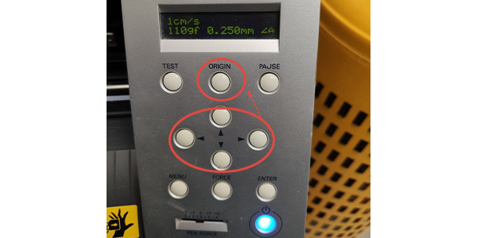

Avviare il taglio da Cutstudio, seguendo il percorso _tagliare_>_ok_.     

Per variare la pressione della lama durante il taglio, è possibile regolarla dallo slider `PEN FORCE`.   
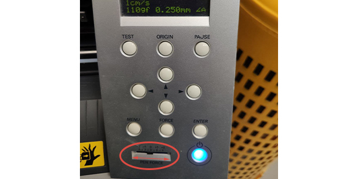 

A taglio eseguito portare in avanti il materiale con il tasto `↓` del pannello di controllo (__operation panel__) e nel caso si stia utilizzando un rotolo, tagliare il rettangolo lavorato.   
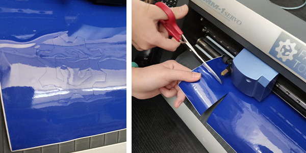   

A fine lavorazione estrarre il rotolo o il foglio, è il passaggio inverso alla [fase di caricamento](#caricare-il-materiale) e consiste nell'abbassare la leva di caricamento (__loading lever__) ed estrarre il materiale.   

### Spegnimento 
A fine utilizzo, spegnere la Vinylcut tenendo premuto il tasto `POWER`.   
   

Espellere la USB dal computer e procedere con lo spegnimento del computer. Per ultimo spegnere lo schermo del computer.  

## Post-processing

Iniziare il post-processing rimuovendo l'adesivo in eccesso sia nella parte esterna, sia in quella interna al contorno di taglio.   
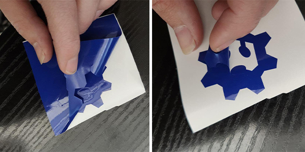  

Per poter trasferire l'adesivo dalla carta protettiva alla superficie di applicazione, bisogna usare il __Transfer__. Tagliare dunque un pezzo di __Transfer__ abbastanza grande da coprire tutto lo sticker.   
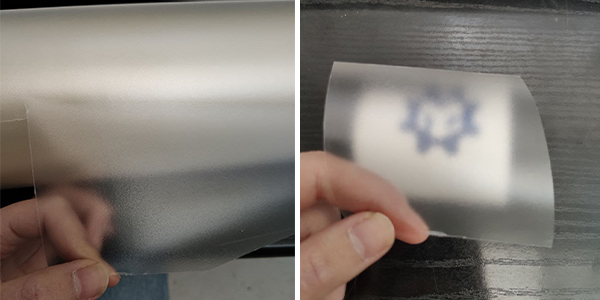   

Applicare il __Transfer__ assicurandosi di avere un'adesione completa e omogenea allo sticker. Per un'ulteriore prova si può sollevare leggermente il __Transfer__ e controllare che lo sticker vi rimanga attaccato, come mostrato in foto.   
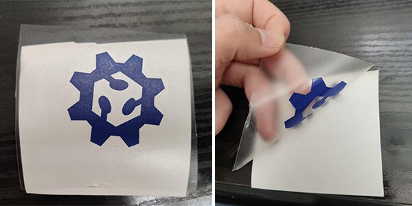   

Finalmente si può applicare lo sticker sulla superficie desiderata!   
Separare il transfer e l'adesivo dalla carta protettiva, posizionarlo sulla superficie scelta e incollarlo in modo omogeneo.   
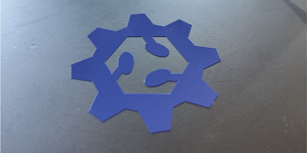

## Inkscape   

Per importare il file su __inkscape__ seguire il percorso _File_>_Importa_>selezionare il file.
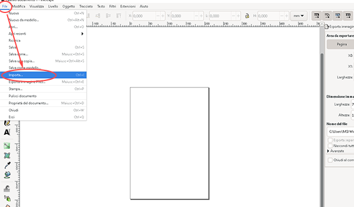   

Aperto il file, il tracciato vettoriale è completamente modificabile su __Inkscape__, inoltre è possibile fare un controllo delle linee cambiando lo stive di visualizzazione tramite il percorso _Visualizza_>_Modalità visualizzazione_>_Scheletro_.   
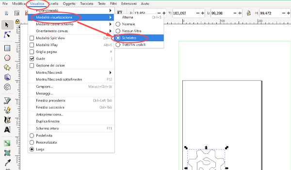

Infine, grazie all'[estensione scaricabile](https://github.com/mgmax/inkscape-roland-cutstudio), è possibile passare direttamente al software __Cutstudio__. Per farlo seguire il percorso _Estensioni_>_Roland CutStudio_>_Open in CutStudio_.   
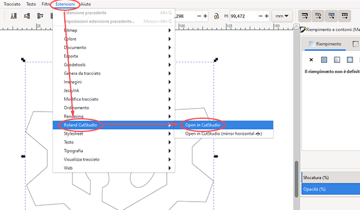

## FAQ
<!-- quali sono i problemi più frequenti? -->
__Il computer e il plotter da taglio sono accesi ma non comunicano tra di loro, perchè?__   
Controllare che i cavi siano tutti inseriti nel modo corretto, come mostrato nella [fase di accensione](#accensione).