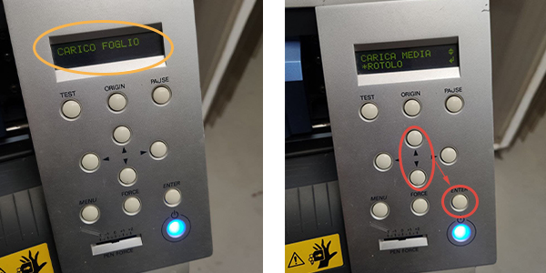

# Vinyl Cutter

La [Vinyl Cutter](https://en.wikipedia.org/wiki/Vinyl_cutter) è un macchinario a controllo numerico utilizzato per il taglio di fogli di plastica autoadesiva (chiamata vinile) e materiali in fogli con uno spessore massimo di 0,5 mm.    

## Applicazioni
Tramite vinylcut si possono produrre banner, striscioni, prespaziati, grafica veicolare, insegne, segnaletica, vetrofanie, retroilluminati, stencil e termo-adesivi per magliette. È inoltre possibile trasformare la macchina in un plotter da disegno a penna, grazie ad appositi adattatori. 

I materiali più utilizzati sono [vinile](http://www.tosingraf.com/vinili-adesivi-da-stampa-e-taglio.html), [poliestere](https://www.cplfabbrika.com/transfer/transfer-laser/poliestere-adesivo-stampabile.html) e [sandblast](https://www.fcsrl.com/categoria-prodotto/vinile-per-sabbiatura/), ma gestisce tranquillamente anche materiali più pesanti come [PVC flessibili](https://www.sinovinyl.com/product/color-pvc-graphic-cutting-vinyl-roll-film/), [floccati](https://tuttotransfer.it/termoadesivi-flex-e-flock-/termoadesivi-flock-floccato-velluto-scamosciato/) e [vinili riflettenti](https://stampacontinua.it/index.php?route=product/category&path=1437_1441).   

## Strumenti, materiali e file
Prima di iniziare assicurati di avere tutto il necessario:
- Vinyl Cutter
- Foglio di vinile
- PC con installato i software necessari 
- File da tagliare
- Accessori (forbici, taglierino, Transfer.)

### Vinyl Cutter Roland CAMM-1 SERVO GX-24

  
  

| Caratteristiche tecniche           | Valori                                   |   
|:-----------------------------------|:-----------------------------------------|   
| Velocità di taglio                 | Da 10 a 500 mm/sec. (tutte le direzioni) |   
| Pressione della lama               | Da 30 a 250 gf                           |   
| Risoluzione del Software           | 0,025 mm/passo                           |   
| Spessore massimo del materiale     | 0,5 mm                                   |   
| Larghezza del materiale caricabile | Da 50 a 700 mm                           |   
| Grandezza massima area di taglio   | Larghezza: 584 mm Lunghezza: 25 m        |   
| Grandezza minima area di taglio    | Larghezza:  Lunghezza:                   |   
| Precisione di ripetizione          | ±0.1 mm o inferiore                      |      

Per ulteriori informazioni consultare la [scheda tecnica](src/scheda-tecnica.pdf) e il [manuale dell'utente](/vinylcut/src/users-manual-en.pdf)

### Foglio di vinile
<!-- Inserire breve descrizione di come è fatto -->

### PC con installato i software necessari

<!-- TODO -->

### File da tagliare

<!-- Mettere i formati e le caratteristiche del  file -->

### Accessori
<!-- Migliorare la descrizione-->
Forbici per tagliare l'adesivo e taglierino per aiutarsi per il post-processing

## Processo di taglio

Per tagliare i fogli in vinile segui i passaggi illustrati in seguito.

### Accensione

Accendere computer e schermo e assicurarsi che il cavo USB sia collegato alla vinycut.   
  

Accendere il macchinario tramite il tasto `POWER` .   

### Caricare il materiale 

Abbassare la leva di caricamento (__loading lever__) sul retro a sinistra.   
   

Inserire posteriormente  il materiale facendolo scorrere attraverso la fessura della macchina e, se necessario, appoggiarlo al __portarotolo__. Posizionare il materiale in modo che sia parallelo alle linee guida (__guide lines__) in rilievo alla base del macchinario.   

Spostare i due rulli di fissaggio (__pinch roller__) negli spazi bianchi segnati, facendoli scorrere dalla parte posteriore della macchina.   
   

Alzare la leva di caricamento (__loading lever__).   
   

Sul display del pannello di controllo (__operation panel__) compare la scritta `CARICO FOGLIO` seguita subito da `CARICA MEDIA`. Scegliere con i tasti `↑` o `↓` il tipo di supporto utilizzato, tra `ROTOLO`, `FOGLIO` o `BORDO`. Premere `ENTER` per confermare.  

### Preparare il file

<!-- Niente istruzioni riguardanti Inkscape? -->

Avviare Cutstudio, per aprire il file di taglio seguire il percorso _importa_>selezionare il file.   

<!-- da inserire come trasformare i png in contorni? -->

La Vinyl Cutter durante il [caricamento del materiale](#caricare-il-materiale) misura in automatico la dimensione della superficie utile di taglio. Per riportare queste misure sul foglio di lavoro seguire il percorso _tagliare_>_modifica_>_proprietà_>_get from machine_. Confermare quindi l'operazione cliccando su _ok_ nelle prime due finestre, ma facendo attenzione a selezionare _annulla_ nell'ultima (come mostrato in giallo in foto).   
   
  
Utilizzare il comando _spostare_ per posizionare i contorni in corrispondenza dell'origine di taglio.   
Per ridurre o aumentare le dimensioni del contorno si può agire sulle frecce agli angoli del file (tieni premuto _SHIFT_ per mantenere le proporzioni) o modificare i valori nella colonna destra (spuntare la casella _Conserva Aspetto_ per mantenere le proporzioni).   

### Parametri di taglio
<!-- Da rivedere da qua in poi -->
In base al materiale si deve modificare la pressione della lama dal pannello di controllo (__operation panel__) premendo sul tasto `FORCE`. Premere `←` o `→` sulla pulsantiera per sbloccare la selezione, quindi modificare i grammi forza con `↑` e `↓` e premere infine `ENTER` per confermare la selezione.   
   

Il __display__ dovrebbe ora indicare la pressione della lama (espressa in gf), ma anche la velocità di taglio e la distanza di Offset. Quest'ultima dipende dalla lama montata ed è importante assicurarsi sempre che l'Offset indicato coincida con quello della lama in utilizzo.   
 

<!-- qui in futuro si può inserire foto dell'adesivo che riporta le caratteristiche della lama, o simile -->

Prima di procedere al taglio è buona pratica fare dei test.Tramite i tasti `↑`, `↓`, `←` e `→` posizionare il carrello di taglio (__cutting carriage__) in uno spazio inutilizzato, quindi premere il tasto `TEST` per almeno un secondo.   
Testare quindi il taglio spellicolando il cerchio, ma senza rimuovere il quadrato al suo interno.   

### Tagliare
Prima di avviare il taglio su un rotolo è bene impostare il punto di origine. Nel caso del rotolo il punto di origine dipende dalla posizione di caricamento ed è quindi utile cambiare il punto di origine del taglio: spostare ilcarrello di taglio (__cutting carriage__) nel punto di origine desiderato con i tasti `←`, `→`, `↑` e `↓`. Nella posizione desiderata premere `ORIGIN` sul pannello di controllo (__operation panel__).   

Si può dunque avviare il taglio da Cutstudio, seguendo il percorso _tagliare_>_ok_.     

Per variare la pressione della lama durante il taglio, è possibile regolarla dallo slider `PEN FORCE`.   
 

A taglio eseguito si può portare in avanti il materiale con il tasto `↓` del pannello di controllo (__operation panel__) e nel caso si stia utilizzando un rotolo, tagliare il rettangolo lavorato.
   

A fine lavorazione o per cambiare il materiale bisogna estrarre il rotolo o il foglio. Questo passaggio è simile alla [fase di caricamento](#caricare-il-materiale) e consiste nell'alzare la leva di caricamento (__loading lever__) ed estrarre il materiale.   

### Spegnimento 
A fine utilizzo, spegnere la Vinylcut tenendo premuto il tasto `POWER`.   
   

Espellere la USB dal computer e procedere con lo spegnimento del computer. Per ultimo spegnere lo schermo del computer.  
      

## Post-processing

Per iniziare il post-processing si deve rimuovere l'adesivo in eccesso sia nella parte esterna, sia in quella interna al contorno di taglio.   
  

Per poter trasferire l'adesivo dalla carta protettiva alla superficie di applicazione, bisogna usare il [__Transfer__ o pellicola di trasferimento](https://www.necchishop.com/prodotto/pellicola-per-il-trasferimento/). Tagliare dunque un pezzo di __Transfer__ abbastanza grande da coprire tutto lo sticker.   
   

Applicare quindi il __Transfer__ assicurandosi di avere un'adesione completa e omogenea allo sticker. Per un'ulteriore prova si può sollevare leggermente il __Transfer__ e controllare che lo sticker vi rimanga attaccato, come mostrato in foto.  
   

Finalmente si può applicare lo sticker sulla superficie desiderata!   
Separare il transfer e l'adesivo dalla carta protettiva, posizionarlo sulla superficie scelta e incollarlo in modo omogeneo.   

## FAQ
